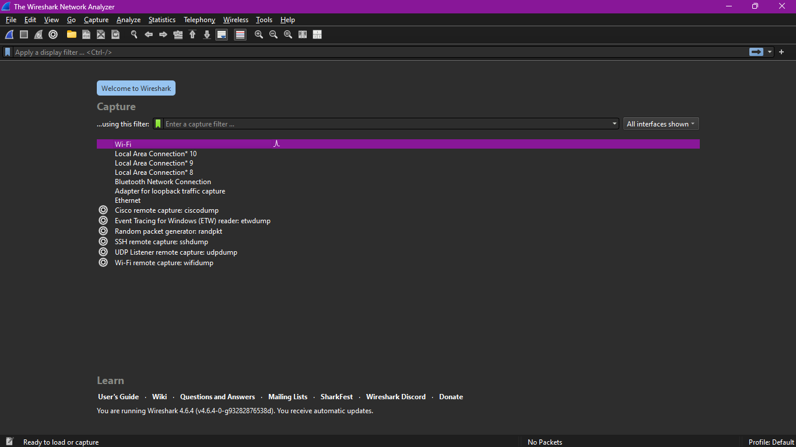
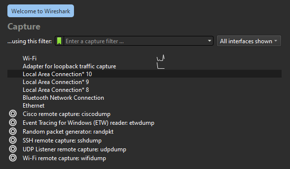
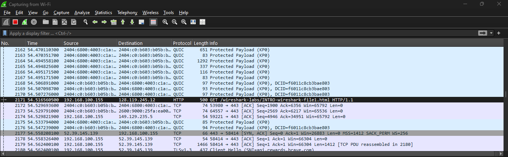
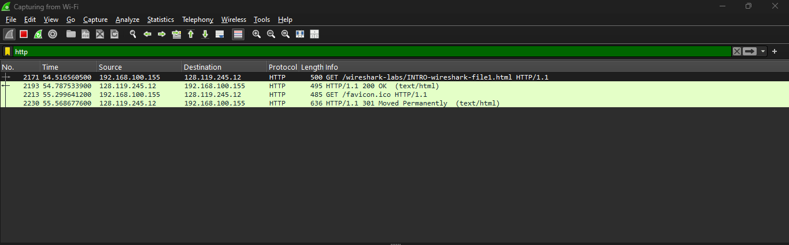
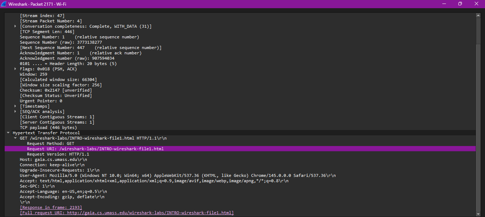
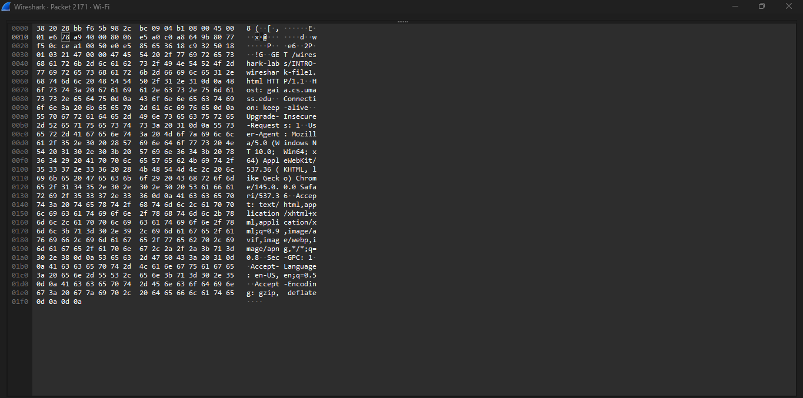

# Laporan Praktikum Jaringan Komputer - Modul 2
## Pengenalan Tools

> **Semester Genap 2025/2026 | Fakultas Informatika | Universitas Telkom**

---

### Identitas Praktikan
| Item | Keterangan |
|------|------------|
| **Nama** | Ridho Bintang Adwitya |
| **NIM** | 103072400015 |
| **Kelas** | IF-04-01 |

---

## 1. Capaian Pembelajaran

Berdasarkan modul praktikum Jaringan Komputer Semester Genap 2025/2026, setelah menyelesaikan modul ini mahasiswa diharapkan mampu:

1. Melakukan instalasi dan konfigurasi awal aplikasi Wireshark.
2. Mengoperasikan Wireshark untuk menangkap lalu lintas paket data.
3. Mengidentifikasi dan menganalisis struktur paket berdasarkan lapisan protokol.

---

## 2. Landasan Teori

### 2.1 Packet Sniffer

Wireshark merupakan implementasi dari **Packet Sniffer**, yaitu perangkat lunak yang berfungsi memonitor dan merekam pertukaran pesan antar entitas protokol dalam jaringan komputer.

| Komponen | Deskripsi |
|----------|-----------|
| **Sifat Kerja** | Pasif — hanya mengamati tanpa mengirim atau memodifikasi paket |
| **Fungsi Utama** | Menangkap (sniff) pesan yang dikirim/diterima oleh komputer |

### 2.2 Struktur Packet Sniffer

| No | Komponen | Fungsi |
|----|----------|--------|
| 1 | Command Menu | Menu pull-down standar (File, Capture, Analyze, Help, dll.) |
| 2 | Packet Listing Window | Menampilkan ringkasan satu baris per paket (No, Time, Source, Destination, Protocol, Info) |
| 3 | Packet Header Details Window | Menampilkan rincian hierarkis protokol paket yang dipilih |
| 4 | Packet Contents Window | Menampilkan isi frame dalam format heksadesimal dan ASCII |
| 5 | Display Filter Field | Kolom input untuk menyaring paket berdasarkan protokol atau kriteria tertentu |

---

## 3. LANGKAH KERJA

### 3.1 Tahapan Praktikum

| Tahap | Aktivitas | Keterangan |
|-------|-----------|------------|
| **Persiapan** | Pastikan koneksi internet aktif, buka browser, jalankan Wireshark | Verifikasi interface jaringan terdeteksi |
| **Start Capture** | Capture > Interfaces > Pilih interface aktif > Start | Pilih Wi-Fi atau Ethernet yang sedang digunakan |
| **Generasi Traffic** | Akses URL: `http://gaia.cs.umass.edu/wireshark-labs/INTRO-wireshark-file1.html` | Tunggu hingga halaman web selesai dimuat |
| **Stop Capture** | Klik tombol Stop (kotak merah) pada toolbar Wireshark | Proses capture selesai, paket tersimpan di memori |
| **Filter Paket** | Ketik `http` pada Display Filter Field, tekan Enter | Hanya paket HTTP yang ditampilkan |
| **Analisis Paket** | Pilih paket HTTP GET, ekspansi detail HTTP, minimalkan protokol lain | Fokus pada field metode, host, user-agent |
| **Selesai** | Tutup aplikasi Wireshark | Praktikum selesai |

### 3.2 URL Target Praktikum

| Parameter | Nilai |
|-----------|-------|
| **URL** | `http://gaia.cs.umass.edu/wireshark-labs/INTRO-wireshark-file1.html` |
| **Protokol** | HTTP (Port 80) |
| **Server** | gaia.cs.umass.edu |
| **Jenis Request** | GET |

---

## 4. HASIL DAN PEMBAHASAN

### 4.1 Dokumentasi Tampilan Wireshark

| No | Deskripsi | Gambar |
|----|-----------|--------|
| 1 | Tampilan awal Wireshark (Welcome Screen) |  |
| 2 | Jendela pemilihan interface capture |  |
| 3 | Daftar paket hasil capture (Packet List) |  |
| 4 | Hasil filter paket dengan ekspresi `http` |  |
| 5 | Detail paket HTTP GET (Packet Details) |  |
| 6 | Konten paket dalam format Hex & ASCII |  |

---

## 5. KESIMPULAN

| No | Poin Kesimpulan | Penjelasan |
|----|----------------|------------|
| 1 | Instalasi Wireshark | Wireshark berhasil diinstal dan berjalan stabil pada sistem operasi yang digunakan |
| 2 | Fungsi Packet Sniffer | Wireshark mampu menangkap paket secara pasif tanpa mengganggu lalu lintas jaringan |
| 3 | Antarmuka Pengguna | Lima komponen utama Wireshark terintegrasi dengan baik untuk memudahkan analisis berlapis |
| 4 | Display Filter | Fitur filter sangat efektif untuk mengisolasi paket spesifik dari ribuan paket yang tertangkap |

---