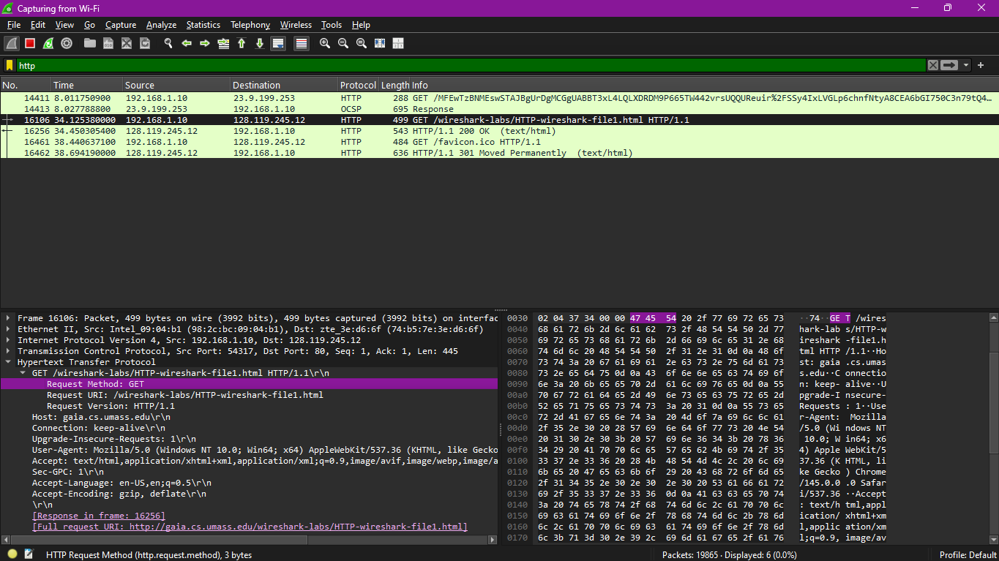
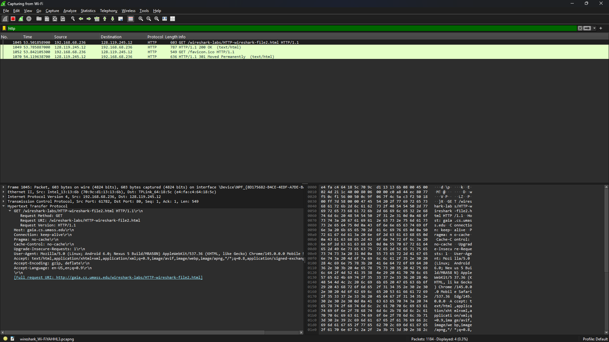
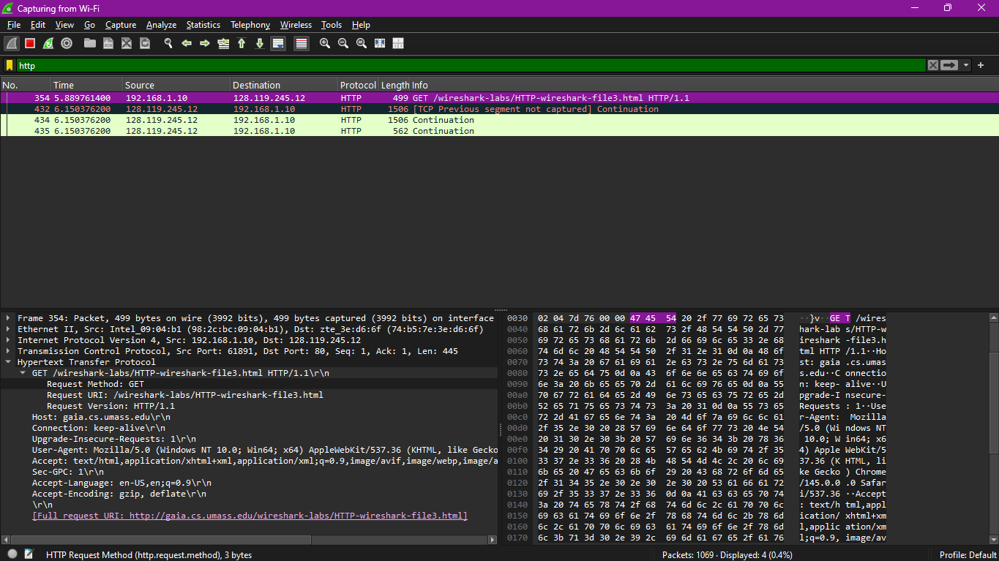
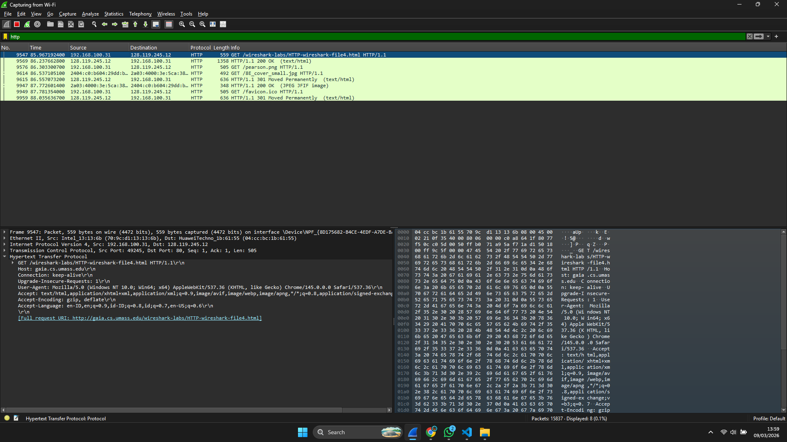
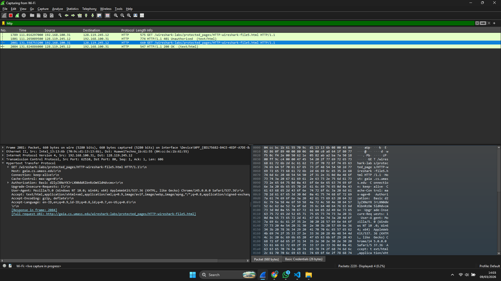

# Laporan Praktikum Jaringan Komputer - Modul 3
## HTTP Protocol Analysis

> **Semester Genap 2025/2026 | Fakultas Informatika | Universitas Telkom**

---

### Identitas Praktikan
| Item | Keterangan |
|------|------------|
| **Nama** | Ridho Bintang Adwitya |
| **NIM** | 103072400015 |
| **Kelas** | IF-04-01 |

---

## 1. Capaian Pembelajaran

Berdasarkan modul praktikum Jaringan Komputer Semester Genap 2025/2026, setelah menyelesaikan modul ini mahasiswa diharapkan mampu:

1. Menginvestigasi cara kerja protokol HTTP menggunakan Wireshark.
2. Mahasiswa memahami Conditional GET, dokumen panjang, embedded objects, dan autentikasi HTTP.

---

# 2. Dasar Teori

| Aspek | Deskripsi Singkat |
|-------|------------------|
| **Basic GET/Response** | Interaksi dasar: klien meminta dokumen, server merespons dengan status code (misal: 200 OK) |
| **Conditional GET** | Mekanisme caching dengan header `If-Modified-Since`; server merespons `304 Not Modified` jika tidak ada perubahan |
| **HTTP & TCP** | Dokumen besar dipecah menjadi beberapa segmen TCP (`TCP segment of a reassembled PDU`) |
| **Embedded Objects** | Halaman HTML dengan gambar/objek lain memicu multiple HTTP GET requests |
| **HTTP Authentication** | Kredensial dikirim via header `Authorization: Basic` (Base64 encoded) |

---

## 3. Langkah Kerja

### 3.1 Ringkasan Prosedur per Skenario

| Skenario | URL Target | Langkah Kunci | Output yang Diharapkan |
|----------|-----------|---------------|----------------------|
| **Basic GET** | `.../HTTP-wireshark-file1.html` | Clear cache → Capture → Akses URL → Stop | Paket GET + Response 200 OK |
| **Conditional GET** | `.../HTTP-wireshark-file2.html` | Akses 2x (refresh) → Analisis header kedua | Header `If-Modified-Since` + Status `304` |
| **Long Document** | `.../HTTP-wireshark-file3.html` | Akses dokumen besar (~4500 byte) | `[TCP segment of a reassembled PDU]` |
| **Embedded Objects** | `.../HTTP-wireshark-file4.html` | Akses halaman dengan 2 gambar | Multiple GET requests (HTML + gambar) |
| **Authentication** | `.../protected_pages/HTTP-wireshark-file5.html` | Login dengan `wireshark-students` / `network` | Header `Authorization: Basic` |

### 3.2 Kredensial Autentikasi

| Parameter | Nilai |
|-----------|-------|
| **Username** | `wireshark-students` |
| **Password** | `network` |
| **Encoding** | Base64 |
| **Header Format** | `Authorization: Basic <encoded_string>` |

---

## 4. Hasil dan Pembahasan

### 4.1 Basic HTTP GET/Response

  
*Gambar 1: Tangkapan paket HTTP GET dan Response 200 OK.*

| Field | Nilai pada Request | Nilai pada Response |
|-------|-------------------|-------------------|
| Method/Status | `GET` | `200 OK` |
| Host/Server | `gaia.cs.umass.edu` | `Apache/2.4.41` |
| Content-Type | `text/html, application/xhtml+xml` | `text/html; charset=ISO-8859-1` |

---

### 4.2 HTTP Conditional GET

  
*Gambar 2: Header If-Modified-Since dan respons 304 Not Modified.*

| Percobaan | Header Khusus | Status Code | Keterangan |
|-----------|--------------|-------------|------------|
| Akses Pertama | - | `200 OK` | Server mengirim full konten |
| Akses Kedua (Refresh) | `If-Modified-Since: ...` | `301 Moved Permanently` | Konten tidak berubah, browser pakai cache |

---

### 4.3 Retrieving Long Documents

  
*Gambar 3: TCP segmentation untuk dokumen besar.*

**Analisis:**
- Respons HTTP tidak muat dalam satu paket TCP.
- Wireshark menampilkan keterangan `[TCP segment of a reassembled PDU]`.
- Ini menunjukkan bahwa lapisan transportasi (TCP) memecah data besar menjadi segmen-segmen kecil sebelum dikirim.

---

### 4.4 HTML Documents dengan Embedded Objects

  
*Gambar 4: Multiple HTTP GET requests untuk HTML + gambar.*

| Resource | Server | Method | Status |
|----------|--------|--------|--------|
| `file4.html` | gaia.cs.umass.edu | GET | 200 OK |
| `pearson.png` | gaia.cs.umass.edu | GET | 200 OK |
| `8E_cover_small.jpg` | caite.cs.umass.edu | GET | 200 OK |

---

### 4.5 HTTP Authentication

  
*Gambar 5: Header Authorization: Basic dengan Base64 encoding.*

| Tahap | Request | Response Server |
|-------|---------|----------------|
| 1 (tanpa auth) | `GET /protected/...` | `401 Authorization Required` |
| 2 (dengan auth) | `GET ... + Authorization: Basic ...` | `200 OK + konten halaman` |

---

## 5. Kesimpulan

| No | Poin Kesimpulan | Implikasi Praktis |
|----|----------------|-------------------|
| 1 | Wireshark efektif untuk analisis HTTP | Memungkinkan inspeksi header, method, status code secara real-time |
| 2 | HTTP bersifat stateless + mendukung caching | Conditional GET (`301`) meningkatkan efisiensi tanpa ubah logika aplikasi |
| 3 | TCP menangani fragmentasi data besar | Developer tidak perlu kelola ukuran payload — TCP otomatis memecah |
| 4 | Embedded objects memicu multiple requests | Browser modern melakukan request paralel untuk percepat loading |
| 5 | HTTP Basic Auth tidak aman tanpa HTTPS | Base64 mudah didecode; selalu enkripsi traffic sensitif dengan TLS |

---
