# Laporan Praktikum Jaringan Komputer - Modul 4
## Domain Name System (DNS)

> **Semester Genap 2025/2026 | Fakultas Informatika | Universitas Telkom**

---

### Identitas Praktikan

| Keterangan | Informasi |
|------------|-----------|
| **Nama Lengkap** | Ridho Bintang Adwitya |
| **NIM** | 103072400015 |
| **Kelas** | IF-04-01 |

---

## 1. Capaian Pembelajaran

| No | Tujuan | Penjelasan Sederhana |
|----|--------|---------------------|
| 1 | Memahami konsep DNS | Mengerti bagaimana nama website diubah jadi angka IP |
| 2 | Menggunakan nslookup | Bisa pakai perintah `nslookup` untuk cek DNS |
| 3 | Mengenal jenis record DNS | Tahu bedanya A, NS, MX, CNAME, dan fungsinya |
| 4 | Memahami hierarki DNS | Mengerti alur dari DNS lokal → root → TLD → server asli |
| 5 | Mengelola cache DNS | Bisa lihat dan hapus cache DNS pakai `ipconfig` |

---

## 2. Dasar Teori (Versi Simpel)

### 2.1 Apa Itu DNS?

| Pertanyaan | Jawaban |
|------------|---------|
| **Kepanjangan** | Domain Name System |
| **Fungsi Utama** | Mengubah nama domain (contoh: `google.com`) jadi alamat IP (contoh: `142.250.185.46`) |
| **Analogi Sederhana** | Seperti buku telepon: cari nama → dapat nomor |
| **Tanpa DNS** | Kita harus hafal angka IP tiap website |

### 2.3 Jenis-Jenis Record DNS

| Jenis Record | Fungsi | Contoh Hasil |
|-------------|--------|-------------|
| **A** | Domain → IPv4 | `google.com` → `142.250.185.46` |
| **AAAA** | Domain → IPv6 | `google.com` → `2404:6800:4001:800::200e` |
| **NS** | Menunjukkan server DNS resmi domain | `google.com` → `ns1.google.com` |
| **MX** | Menunjukkan server email domain | `yahoo.com` → `mta7.am0.yahoodns.net` |
| **CNAME** | Nama alias / redirect domain | `www.mit.edu` → `mit.edu.edgekey.net` |
| **PTR** | IP → Domain (kebalikan A record) | `142.250.185.46` → `google.com` |

---

## 3. Langkah Kerja 

### 3.1 Ringkasan Semua Percobaan

| No | Percobaan | Perintah / URL | Yang Diamati |
|----|-----------|---------------|-------------|
| 1 | Query A Record | `nslookup www.mit.edu` | IP dari domain |
| 2 | Query NS Record | `nslookup -type=NS www.mit.edu` | Server DNS resmi domain |
| 3 | Query ke DNS tertentu | `nslookup www.aiit.or.kr 8.8.8.8` | Beda hasil pakai DNS Google |
| 4 | Query domain Asia | `nslookup www.nus.edu.sg` | IP server di Singapura |
| 5 | Query NS domain Eropa | `nslookup -type=NS www.ox.ac.uk` | Name server University of Oxford |
| 6 | Query MX Record | `nslookup -type=MX yahoo.com 8.8.8.8` | Server email Yahoo |
| 7 | Cek konfigurasi jaringan | `ipconfig /all` | Info IP, DNS, gateway laptop |
| 8 | Lihat cache DNS | `ipconfig /displaydns` | Daftar domain yang pernah diakses |
| 9 | Analisis DNS via Wireshark tanpa nslookup| Akses `www.ietf.org` + capture | Paket DNS query & response |
| 10 | Analisis nslookup via Wireshark | `nslookup www.mit.edu` + capture | Detail paket DNS dari tool |

---

## 📸 4. Hasil dan Pembahasan

### 4.1 Query A Record (Domain → IP)

> **Gambar 1**: Hasil `nslookup www.mit.edu`  
> 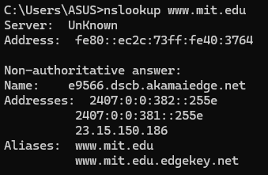

| Informasi | Nilai |
|-----------|-------|
| Domain yang dicek | `www.mit.edu` |
| Hasil IP | `23.15.150.186` |
| DNS Server yang dipakai | DNS lokal (dari `ipconfig`) |
| Status jawaban | Non-authoritative (dari cache) |

---

### 4.2 Query NS Record (Siapa Server Resminya?)

> **Gambar 2**: Hasil `nslookup -type=NS www.mit.edu`  
> 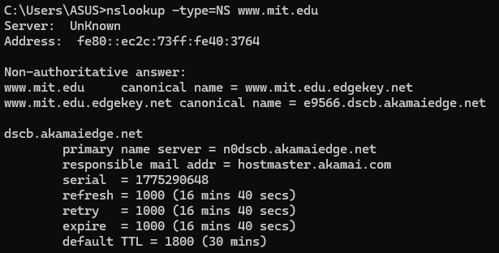

| Informasi | Nilai |
|-----------|-------|
| Domain | `www.mit.edu` |
| Jenis Query | NS (Name Server) |
| Hasil | Daftar server DNS resmi MIT |
| Contoh | `dscb.akamaiedge.net` |

---

### 4.3 Query ke DNS Server Tertentu

> **Gambar 3**: Hasil `nslookup www.aiit.or.kr 8.8.8.8`  
> 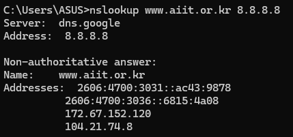

| Parameter | Nilai |
|-----------|-------|
| Domain | `www.aiit.or.kr` |
| DNS Server yang dipakai | `8.8.8.8` (Google Public DNS) |
| Hasil IP | `172.67.152.120`, `104.21.74.8` |

---

### 4.4 Query Alamat IP Server Web di Asia

> **Gambar 4**: Hasil `nslookup www.nus.edu.sg`  
> 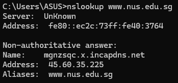

| Domain | Lokasi | Hasil IP | Keterangan |
|--------|--------|----------|------------|
| `www.nus.edu.sg` | Singapura 🇸🇬 | `45.60.35.225` | National University of Singapore |

**Analisis:**

* Perintah `nslookup www.nus.edu.sg` digunakan untuk mengetahui alamat IP dari domain tersebut.
* Domain **[www.nus.edu.sg](http://www.nus.edu.sg)** merupakan server web milik National University of Singapore (NUS) di Asia.
* Hasil query menampilkan satu atau lebih alamat IP yang terasosiasi dengan domain tersebut.
* Alamat IP inilah yang digunakan oleh client untuk mengakses server web tujuan.
* Query ini menunjukkan proses dasar resolusi DNS dari nama domain menjadi alamat IP.

---

### 4.5 Query DNS Otoritatif (NS Record)

> **Gambar 5**: Hasil `nslookup -type=NS www.ox.ac.uk`  
> 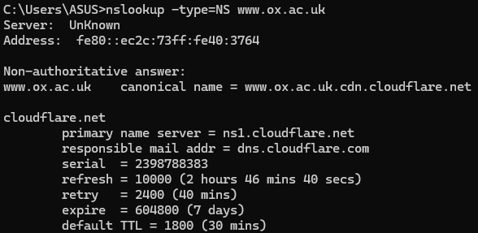

**Analisis:**

* Perintah `nslookup -type=NS www.ox.ac.uk` digunakan untuk mengetahui server DNS otoritatif dari domain tersebut.
* Hasil query menampilkan daftar **Name Server (NS)** yang bertanggung jawab atas domain **[www.ox.ac.uk](http://www.ox.ac.uk)**.
* Server DNS otoritatif adalah server yang memiliki informasi resmi terkait domain tersebut.
* Informasi ini penting untuk memahami bagaimana DNS mendistribusikan tanggung jawab pengelolaan domain.
* Domain tersebut merupakan milik University of Oxford di Eropa.

---

### 4.6 Query MX Record (Server Email)

> **Gambar 6**: Hasil `nslookup -type=MX yahoo.com 8.8.8.8`  
> 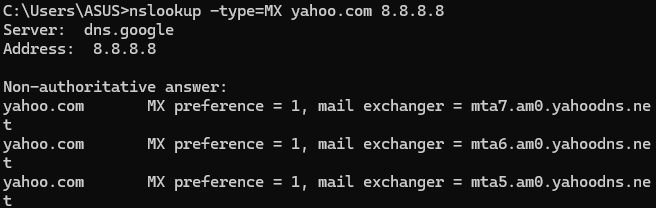

| Mail Server | Fungsi |
|-------------|--------|
| `mta7.am0.yahoodns.net` | Prioritas tertinggi |
| `mta6.am0.yahoodns.net` | Cadangan |
| `mta5.am0.yahoodns.net` | Cadangan lagi |

**Penjelasan Priority:**
- Angka kecil = prioritas lebih tinggi
- Email dikirim ke server priority 1 dulu
- Kalau gagal, coba priority 5, lalu 10, dst.

---

### 4.7 Perintah ipconfig (Cek & Kelola Jaringan)

#### 4.7.1 `ipconfig /all` — Lihat Semua Info Jaringan

> **Gambar 7**: Hasil `ipconfig /all`  
> 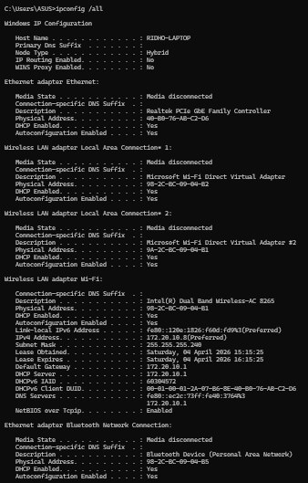

| Informasi | Contoh Nilai | Kegunaan |
|-----------|-------------|----------|
| IPv4 Address | `192.168.1.100` | Alamat laptop di jaringan lokal |
| Subnet Mask | `255.255.255.0` | Menentukan rentang jaringan |
| Default Gateway | `192.168.1.1` | Alamat router / modem |
| DNS Servers | `192.168.1.1`, `8.8.8.8` | Server yang dipakai untuk resolusi DNS |
| Physical Address | `AA:BB:CC:DD:EE:FF` | MAC Address adapter jaringan |

#### 4.7.2 `ipconfig /displaydns` — Lihat Cache DNS

> **Gambar 8**: Hasil `ipconfig /displaydns`  
> 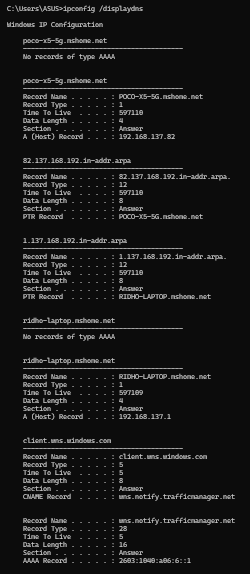

| Field | Arti |
|-------|------|
| Record Name | Nama domain yang di-cache |
| Record Type | Jenis record (A, AAAA, CNAME, dll) |
| Time To Live | Berapa detik lagi cache ini kadaluarsa |
| Data Length | Ukuran data record |
| Section | Bagian pesan DNS (Answer, Authority, Additional) |

---

### 4.8 Analisis DNS via Wireshark (Tanpa nslookup)

> **Gambar 10-11**: Capture DNS saat akses `www.ietf.org`  
> 
> 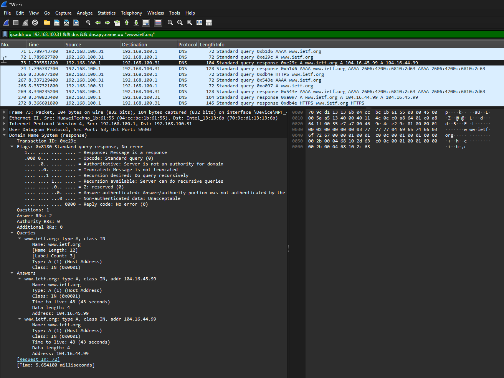

#### 4.8.1 Pertanyaan & Jawaban Analisis

| No | Pertanyaan | Jawaban |
|----|-----------|---------|
| 1 | Pakai UDP atau TCP? | **UDP** (lebih cepat untuk query kecil) |
| 2 | Port sumber & tujuan? | Sumber: ephemeral (misal 56839), Tujuan: **53** (DNS) |
| 3 | IP tujuan query = DNS lokal? | ✅ Ya, sama dengan yang muncul di `ipconfig` |
| 4 | Jenis query? | **A** (IPv4) dan **AAAA** (IPv6) |
| 5 | Apakah query punya jawaban? | ❌ Tidak, query hanya pertanyaan |
| 6 | Isi jawaban response? | IPv4: `104.16.45.99`, `104.16.44.99` + IPv6 addresses |
| 7 | IP di response cocok dengan TCP SYN? | ✅ Ya, browser langsung konek ke IP tersebut |
| 8 | Perlu query DNS tiap gambar? | ❌ Tidak, karena ada cache DNS (TTL) |

### 4.9 Analisis DNS via Wireshark + nslookup

> **Gambar 12-13**: Capture `nslookup www.mit.edu`  
> 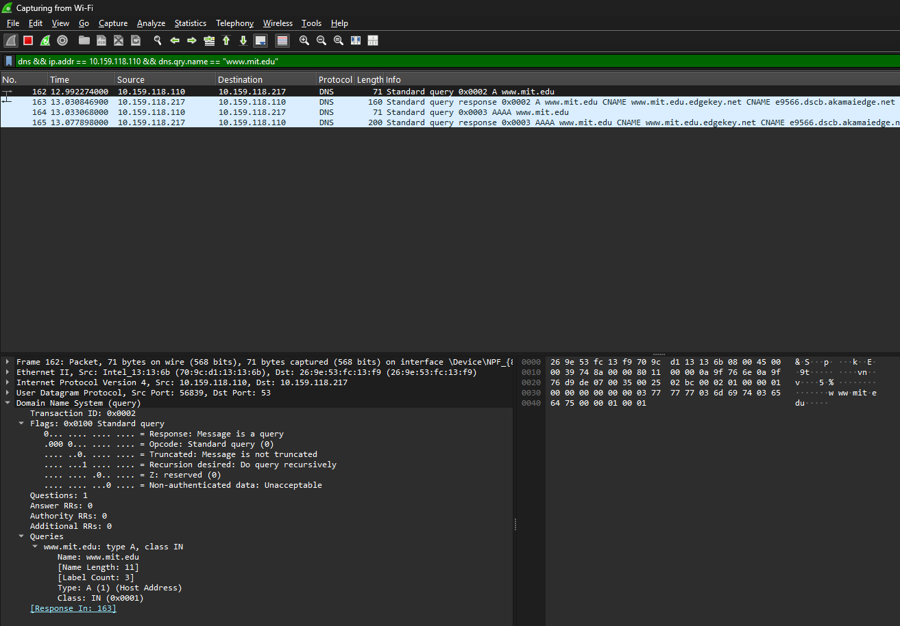
> 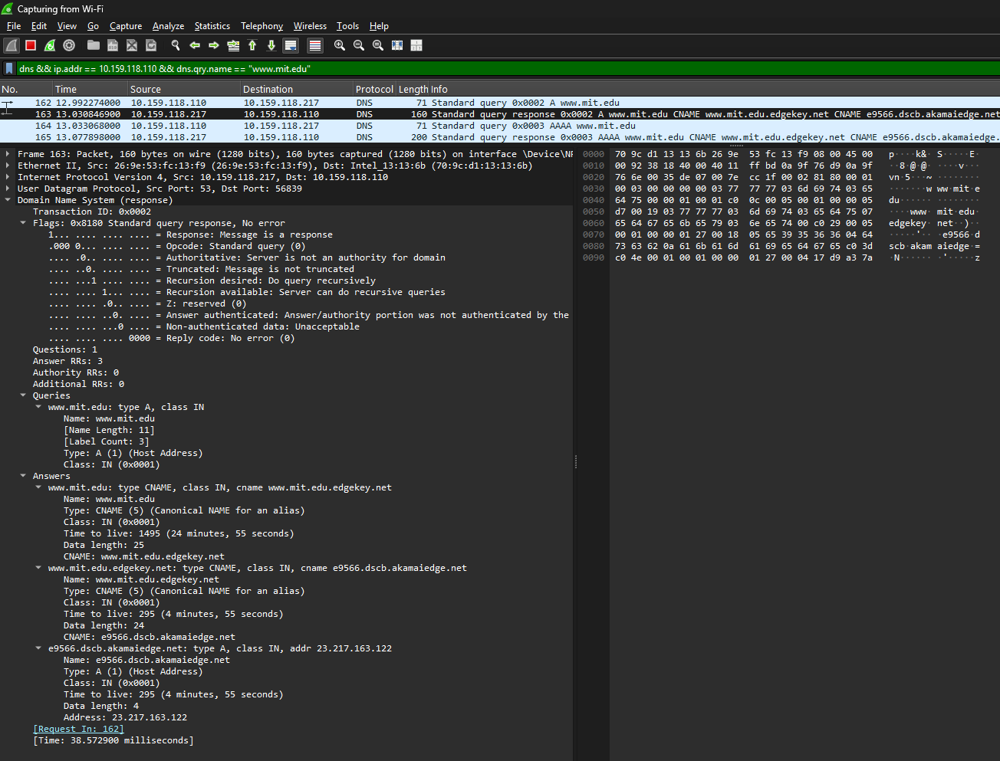

#### 4.9.1 Port Tujuan dan Sumber

| Jenis Paket  | Port Sumber | Port Tujuan |
| ------------ | ----------- | ----------- |
| DNS Query    | 56839       | 53          |
| DNS Response | 53          | 56839       |

* Port **53** digunakan oleh DNS server
* Port **56839** adalah *ephemeral port* dari client

---

#### 4.9.2 Alamat IP tujuan DNS

* IP tujuan DNS Query: **10.159.118.217**
* IP tersebut merupakan **DNS server lokal** (jika sesuai dengan hasil `ipconfig`)

---

#### 4.9.3 Jenis Query dan Kandungan Jawaban

* Tipe query: **A (IPv4 Address)**
* Jumlah pertanyaan: 1
* **Tidak terdapat jawaban pada query (Answer RRs = 0)**

Hal ini karena query hanya berisi permintaan, sedangkan jawaban terdapat pada response.

---

#### 4.9.4 Isi Jawaban DNS Response

| No | Type | Name | Data / IP | TTL |
|----|------|------|-----------|-----|
| 1 | CNAME | `www.mit.edu` | `www.mit.edu.edgekey.net` | 1495s |
| 2 | CNAME | `www.mit.edu.edgekey.net` | `e9566.dscb.akamaiedge.net` | 295s |
| 3 | A | `e9566.dscb.akamaiedge.net` | `23.217.163.122` | 20s |

---

### 4.10 Tracing DNS dengan Wireshark - Query ke DNS Server Spesifik

> **Gambar 14-15**: Capture DNS saat akses `www.aiit.or.kr`    
> 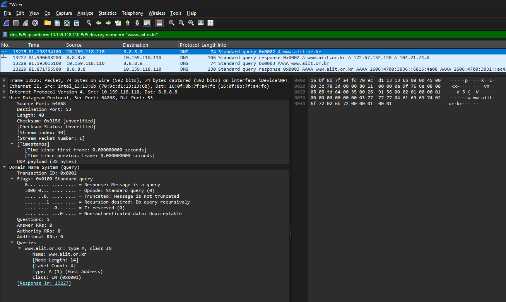
> 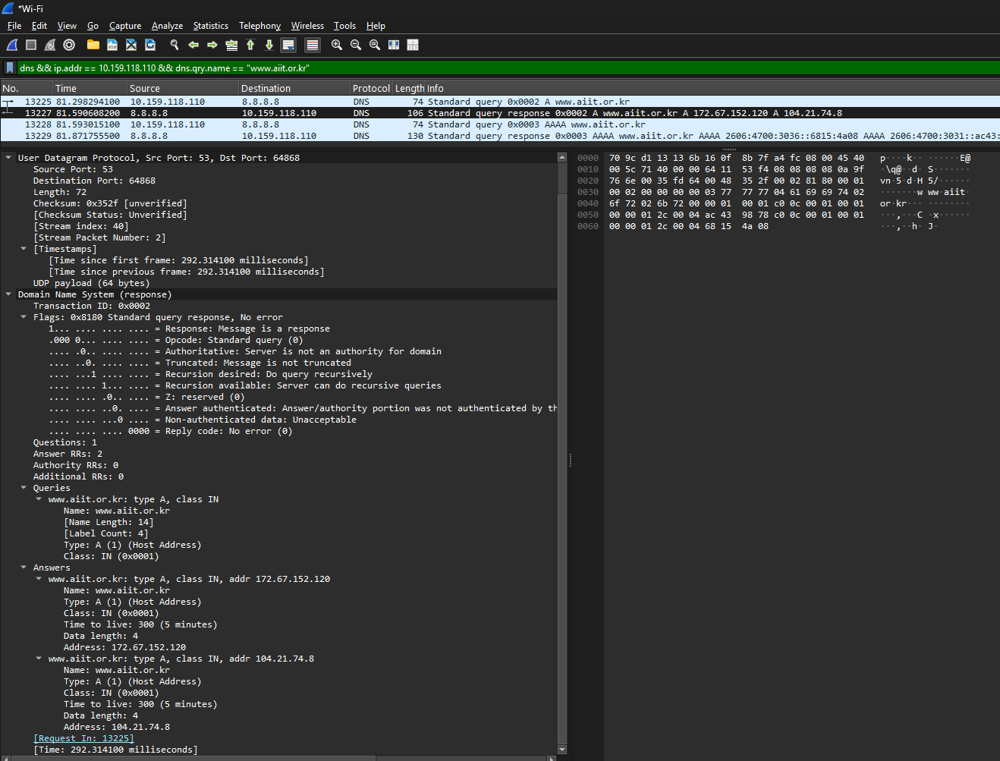

#### 4.10.1 Alamat IP Tujuam DNS Query

* IP tujuan: **8.8.8.8**
* DNS lokal (berdasarkan konfigurasi): **10.159.118.217**

Query dikirim ke **Google Public DNS (8.8.8.8)**, bukan DNS lokal.

* Kemungkinan terjadi resolusi awal untuk server **bitsy.mit.edu**
* Atau sistem menggunakan DNS publik sebagai resolver utama

---

#### 4.10.2 Jenis Query DNS

* Tipe: **A (IPv4 Address)**
* Jumlah pertanyaan: 1
* **Tidak mengandung jawaban (Answer RRs = 0)**

Query hanya berisi permintaan, sedangkan jawaban terdapat pada response.

---

#### 4.10.3 Isi Jawaban DNS Response

Jumlah jawaban: **2 record (A)**

| No | Domain                                  | IP Address         | TTL       |
| -- | --------------------------------------- | ------------------ | --------- |
| 1  | [www.aiit.or.kr](http://www.aiit.or.kr) | **172.67.152.120** | 300 detik |
| 2  | [www.aiit.or.kr](http://www.aiit.or.kr) | **104.21.74.8**    | 300 detik |

**Analisis:**

* Domain memiliki **lebih dari satu IP** → load balancing
* IP termasuk dalam jaringan Cloudflare (CDN)
* TTL: 300 detik (5 menit) → cache relatif singkat
* Response bersifat **non-authoritative** (dari cache DNS)
* Response time ±292 ms (lebih lambat dibanding DNS lokal)

---

#### 4.10.4 Karakteristik Tambahan

* Menggunakan protokol **UDP port 53**
* Terdapat query tambahan tipe **AAAA (IPv6)**
* Mendukung **dual-stack network (IPv4 & IPv6)**

---

## 5. Kesimpulan

| No | Poin Kesimpulan | Penjelasan Simpel |
|----|----------------|-------------------|
| 1 | DNS itu penting | Tanpa DNS, kita harus hafal angka IP tiap website |
| 2 | nslookup itu berguna | Tool simpel buat cek "IP dari domain X apa?" |
| 3 | DNS punya banyak jenis record | A untuk IP, NS untuk server resmi, MX untuk email, dll |
| 4 | DNS bekerja bertingkat | Dari cache → DNS lokal → root → TLD → server asli |
| 5 | DNS pakai UDP port 53 | Lebih cepat daripada TCP untuk query kecil |
| 6 | Satu domain bisa punya banyak IP | Untuk load balancing dan backup (redundancy) |
| 7 | CDN bikin DNS lebih kompleks | Domain bisa redirect ke server edge terdekat |
| 8 | Cache DNS menghemat waktu | Hasil query disimpan sementara (TTL) agar tidak tanya ulang |
| 9 | DNS publik vs lokal ada trade-off | Lokal cepat, publik stabil — pilih sesuai kebutuhan |
| 10 | Wireshark bantu "lihat" DNS | Bisa intip paket query/response secara real-time |

---