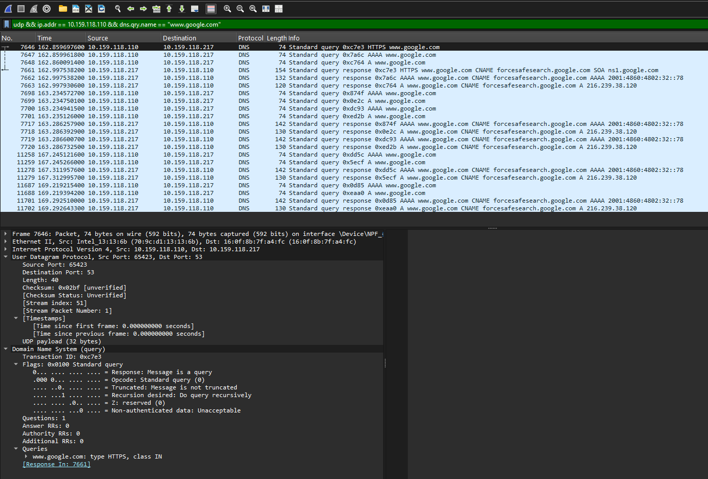
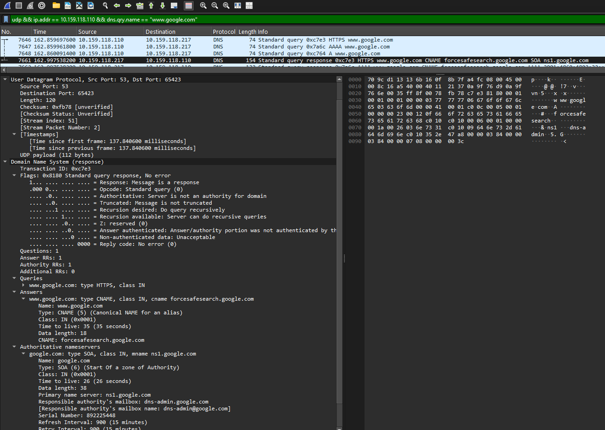

# Laporan Praktikum Jaringan Komputer - Modul 5
## User Datagram Protocol (UDP)

> **Semester Genap 2025/2026 | Fakultas Informatika | Universitas Telkom**

---

### Identitas Praktikan

| Keterangan | Informasi |
|------------|-----------|
| **Nama Lengkap** | Ridho Bintang Adwitya |
| **NIM** | 103072400015 |
| **Kelas** | IF-04-01 |

---

## 1. Tujuan Praktikum

| No | Tujuan | Penjelasan Sederhana |
|----|--------|---------------------|
| 1 | Investigasi cara kerja UDP | Mengerti bagaimana UDP kirim data tanpa "jabatan tangan" dulu |
| 2 | Identifikasi struktur header UDP | Tahu isi 4 field di header UDP dan fungsinya |
| 3 | Analisis port source-destination | Paham bagaimana port saling "balas" saat komunikasi |
| 4 | Hitung kapasitas payload UDP | Bisa hitung berapa maksimal data yang bisa dikirim UDP |

---

## 2. Dasar Teori (Versi Simpel)

### 2.1 Apa Itu UDP?

| Pertanyaan | Jawaban |
|------------|---------|
| **Kepanjangan** | User Datagram Protocol |
| **Lapisan OSI** | Transport Layer (Layer 4) |
| **Sifat Utama** | Connectionless (tanpa koneksi tetap), unreliable (tidak jamin sampai), fast (cepat) |
| **Analogi Sederhana** | Seperti kirim surat pos: kirim langsung, tidak tunggu konfirmasi |
| **Beda dengan TCP** | TCP = kirim paket terdaftar (ada konfirmasi), UDP = kirim surat biasa (langsung kirim) |

### 2.2 Kapan Pakai UDP?

| Aplikasi | Alasan Pakai UDP |
|----------|-----------------|
| Online Gaming | Butuh cepat, kalau telat sedikit tidak masalah |
| Video Streaming | Lebih baik gambar skip sedikit daripada buffering lama |
| VoIP / Zoom | Suara real-time lebih penting daripada sempurna |
| DNS Query | Query kecil, cepat, tidak perlu koneksi lama |
| Broadcast/Multicast | Kirim ke banyak perangkat sekaligus |

---

## 3. Langkah Kerja Praktikum

### 3.1 Ringkasan Prosedur

| Tahap | Aktivitas | Perintah / Filter | Tujuan |
|-------|-----------|------------------|--------|
| **Persiapan** | Buka Wireshark, pilih interface Wi-Fi | - | Siap capture traffic |
| **Flush DNS** | Hapus cache DNS lama | `ipconfig /flushdns` | Pastikan query DNS benar-benar terjadi |
| **Generate Traffic** | Jalankan nslookup | `nslookup google.com` | Memicu traffic UDP ke DNS server |
| **Stop Capture** | Klik tombol Stop di Wireshark | - | Selesai merekam paket |
| **Filter Paket** | Terapkan filter UDP + DNS | `udp && ip.addr == 10.159.118.110 && dns.qry.name == "www.google.com"` | Tampilkan hanya paket yang relevan |
| **Analisis** | Pilih paket → lihat detail UDP | - | Identifikasi field header dan hitung payload |

---

## 4. Hasil dan Pembahasan

### 4.1 Hasil Capture Paket UDP

> **Gambar 1**: DNS Query (UDP)  
> 

> **Gambar 2**: DNS Response (UDP)  
> 

**Ringkasan Paket yang Tertangkap:**

| Frame | Tipe | Source | Destination | Length | Keterangan |
|-------|------|--------|-------------|--------|------------|
| 7646 | DNS Query | `10.159.118.110:65423` | `10.159.118.217:53` | 74 byte | Client tanya DNS |
| 7661 | DNS Response | `10.159.118.217:53` | `10.159.118.110:65423` | 120 byte | Server jawab query |

**Penjelasan Simpel:**
- Client pakai port acak `65423` untuk kirim pertanyaan
- Server DNS selalu pakai port `53` (standar internasional)
- Response "membalik" port: yang tadi tujuan jadi sumber, dan sebaliknya

---

### 4.2 Analisis Detail Header UDP

#### 4.2.1 Perbandingan Query vs Response

| Field Header | Pada Query (Frame 7646) | Pada Response (Frame 7661) |
|-------------|------------------------|---------------------------|
| **Source Port** | 65423 (ephemeral client) | 53 (DNS server) |
| **Destination Port** | 53 (DNS server) | 65423 (ephemeral client) |
| **Length** | 74 byte | 120 byte |
| **Checksum** | `0x02bf` | `0xfb78` |

#### 4.2.2 Perhitungan Payload UDP

| Paket | Length Total | Header UDP | Payload (Data Asli) |
|-------|-------------|------------|-------------------|
| Query | 74 byte | 8 byte | **66 byte** |
| Response | 120 byte | 8 byte | **112 byte** |

**Apa isi payload-nya?**
- Payload query: Pertanyaan DNS "Berapa IP www.google.com?"
- Payload response: Jawaban DNS + informasi tambahan (CNAME, TTL, dll)

---

### 4.3 Perhitungan Teknis UDP

#### 4.3.1 Kapasitas Maksimum UDP

| Parameter | Rumus / Penjelasan | Hasil |
|-----------|-------------------|-------|
| Maksimum Length field | 16-bit unsigned integer → 2¹⁶ - 1 | **65.535 byte** |
| Maksimum Payload | 65.535 - 8 (header UDP) | **65.527 byte** |
| Rentang Port Number | 0 sampai 2¹⁶ - 1 | **0 - 65.535** |
| Protocol Number di IP Header | UDP = 17 (desimal) / 0x11 (hex) | **17** |

#### 4.3.2 Batasan Praktis (Agar Tidak Fragmentasi)

- MTU Ethernet Standar = 1500 byte
- IP Header (tanpa opsi) = 20 byte
- UDP Header = 8 byte
- Maksimum Payload Aman = 1500 - 20 - 8 = 1472 byte

| Skenario | Maksimum Payload | Keterangan |
|----------|-----------------|------------|
| Teoritis (tanpa batas jaringan) | 65.527 byte | Bisa, tapi berisiko fragmentasi |
| Praktis (Ethernet standar) | **1472 byte** | Aman, tidak fragmentasi |
| Praktis (dengan IP options) | < 1472 byte | Kurangi lagi kalau IP header lebih besar |

---

### 4.4 Pola Komunikasi Request-Response UDP

#### 4.4.1 Mapping Port & IP

```
REQUEST:  10.159.118.110:65423 → 10.159.118.217:53
RESPONSE: 10.159.118.217:53    → 10.159.118.110:65423
```

#### 4.4.2 Poin Kunci Komunikasi UDP

| Konsep | Penjelasan | Contoh pada Praktikum |
|--------|-----------|---------------------|
| **Port Reversal** | Port source-destination dibalik saat response | Query: src=65423→dst=53 ; Response: src=53→dst=65423 |
| **Ephemeral Port** | Port sementara client (range dinamis) | Client pakai `65423` (masuk range 49152-65535) |
| **Well-Known Port** | Port standar layanan (0-1023) | DNS server selalu di port `53` |
| **Transaction ID** | ID unik untuk cocokkan query-response | DNS pakai ID `0xc7e3` sama di query & response |
| **Stateless** | Server tidak simpan "sesi" antar paket | Setiap query DNS independen, tidak ingat query sebelumnya |

#### 4.4.3 Hasil Query DNS dalam Praktikum

| Field | Nilai | Keterangan |
|-------|-------|------------|
| Query Type | HTTPS (65) | RFC 8484: DNS over HTTPS, bukan type A biasa |
| Domain | `www.google.com` | Domain yang ditanyakan |
| Response | CNAME → `forcesafesearch.google.com` | Google SafeSearch aktif di jaringan ini |
| Transaction ID | `0xc7e3` | Sama di query & response → untuk matching |

---

## 5. Ringkasan Hasil Praktikum

### 5.1 Tabel Ringkasan Parameter UDP

| Parameter | Nilai / Hasil | Keterangan |
|-----------|--------------|------------|
| Jumlah field header UDP | 4 field | Source Port, Dest Port, Length, Checksum |
| Ukuran total header UDP | 8 byte | Fixed, tidak berubah-ubah |
| Payload query DNS | 66 byte | 74 - 8 |
| Payload response DNS | 112 byte | 120 - 8 |
| Maksimum payload teoritis | 65.527 byte | 2¹⁶ - 1 - 8 |
| Maksimum payload praktis (Ethernet) | ~1472 byte | Agar tidak fragmentasi IP |
| Rentang port UDP | 0 - 65.535 | 16-bit field |
| Protocol number UDP di IP header | 17 (0x11) | Identifier di field "Protocol" IP |
| Pola port request-response | Dibalik (source ↔ destination) | Client port ↔ Server port |
| Protokol transport DNS | UDP (biasanya) | Kecuali response > 512 byte, pakai TCP |

### 5.2 Perbandingan UDP vs TCP (Singkat)

| Aspek | UDP | TCP |
|-------|-----|-----|
| Koneksi | Connectionless | Connection-oriented (3-way handshake) |
| Keandalan | Tidak jamin sampai/urut | Ada ACK, retransmission, sequencing |
| Overhead Header | 8 byte (kecil) | 20+ byte (lebih besar) |
| Kecepatan | Lebih cepat | Lebih lambat karena kontrol |
| Flow Control | Tidak ada | Ada (windowing) |
| Cocok Untuk | Streaming, gaming, DNS | Web, email, file transfer |


