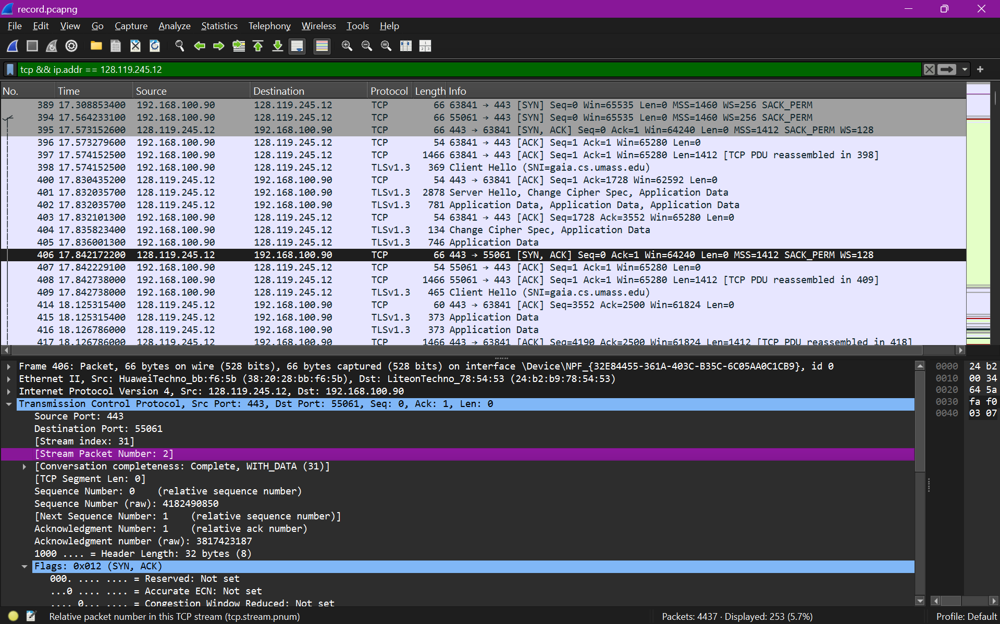
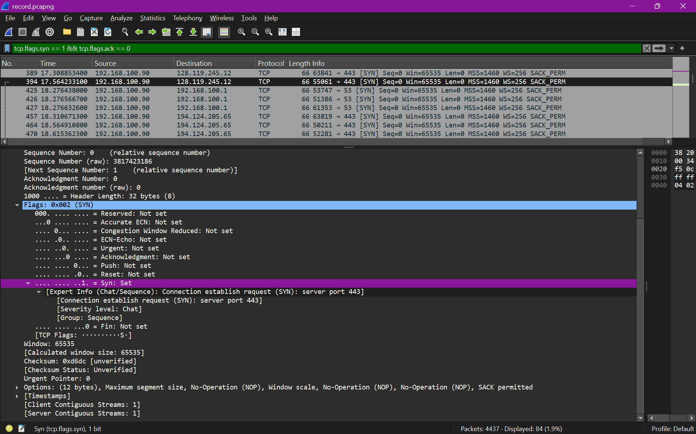
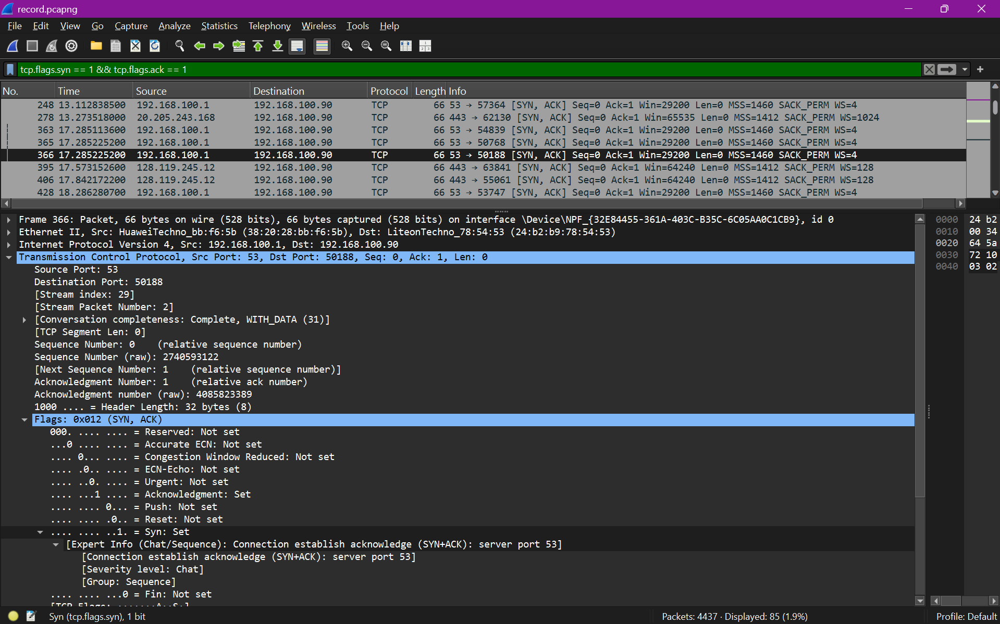
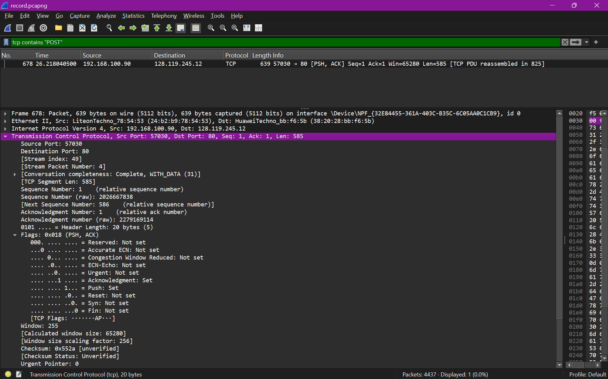
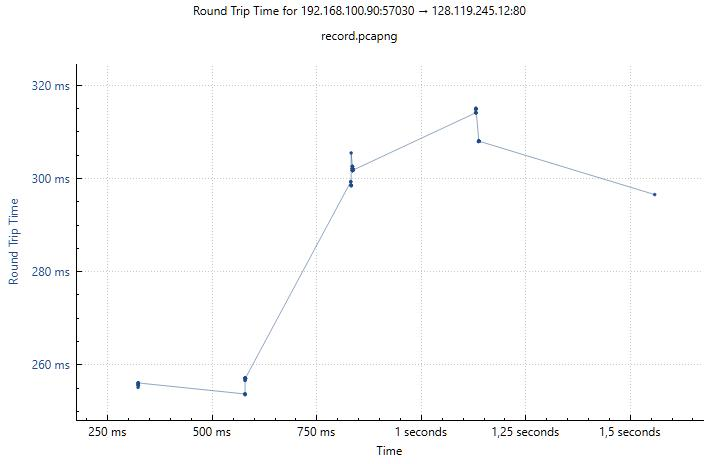
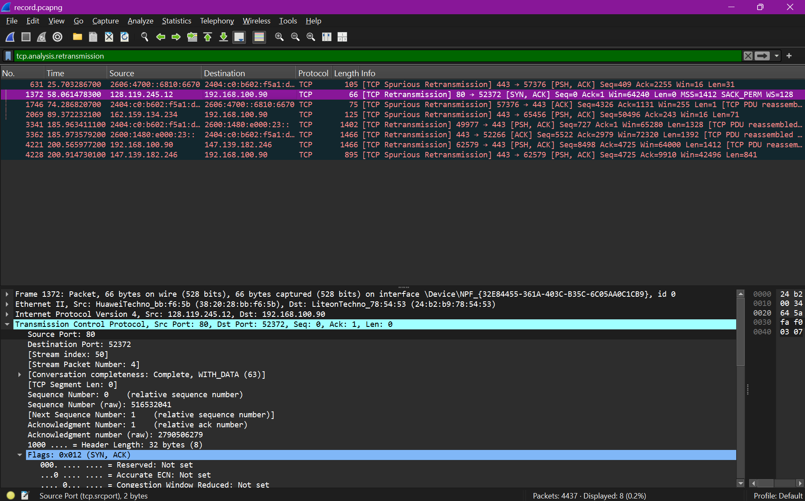
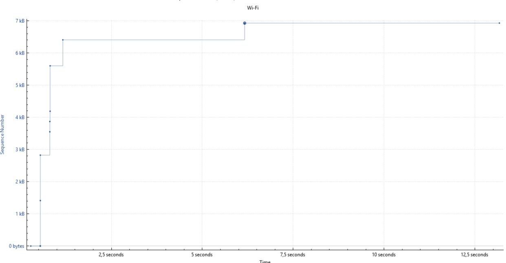

# Laporan Praktikum Jaringan Komputer - Modul 6
## Transmission Control Protocol (TCP) Analysis

### Identitas Praktikan
| Item | Keterangan |
|------|-----------|
| **Nama** | Ridho Bintang Adwitya |
| **NIM** | 103072400015 |
| **Kelas** | IF-04-01 |

---

## 1. Tujuan Praktikum
| No | Tujuan | Penjelasan |
|----|--------|-----------|
| 1 | Analisis cara kerja TCP | Mengerti bagaimana TCP kirim data dengan jaminan sampai |
| 2 | Identifikasi sequence & acknowledgment | Paham cara TCP lacak data yang dikirim dan diterima |
| 3 | Amati congestion control | Melihat bagaimana TCP atur kecepatan kirim agar tidak macet |
| 4 | Hitung throughput & RTT | Bisa ukur kecepatan dan delay koneksi TCP |

---

## 2. Langkah Kerja

| No | Tahap | Aktivitas | Tujuan |
|----|-------|-----------|--------|
| 1 | Persiapan | Download alice.txt | File referensi |
| 2 | Buka halaman | Akses TCP-wireshark-file1 | Halaman upload |
| 3 | Start capture | Wireshark + filter TCP | Rekam traffic |
| 4 | Generate traffic | Upload alice.txt via browser | Buat data TCP |
| 5 | Stop capture | Klik Stop di Wireshark | Selesai rekam |
| 6 | Analisis | Statistics → TCP Graphs | Insight data |

---

## 3. Hasil Praktikum

### 3.1 Identitas Koneksi



| Parameter | Nilai |
|-----------|-------|
| Client IP | 192.168.100.90 |
| Client Port | 55061 |
| Server IP | 128.119.245.12 |
| Server Port | 443 (HTTPS) |
| Protocol | TCP |
| Application | HTTP over TLS |

---

### 3.2 Three-Way Handshake

**1. SYN (Client → Server)**


| Field | Nilai |
|-------|-------|
| Sequence Number | 0 (relative) |
| Flags | SYN |
| MSS | 1460 bytes |
| Window Scale | ×256 |

**2. SYN-ACK (Server → Client)**


| Field | Nilai |
|-------|-------|
| Sequence Number | 0 |
| Acknowledgment | 1 |
| Flags | SYN, ACK |

**3. ACK (Client → Server)**
- Sequence: 1, Acknowledgment: 1, Flags: ACK
- Koneksi established, siap transfer data

---

### 3.3 HTTP POST Segment



| Field | Nilai |
|-------|-------|
| Frame | 678 |
| Source | 192.168.100.90:57030 |
| Destination | 128.119.245.12:80 |
| Sequence Number | 1 |
| Payload | 585 bytes |
| Flags | PSH, ACK |
| Window Size | 65,280 bytes |

---

### 3.4 Analisis 6 Segmen Pertama: RTT & EstimatedRTT



**Rumus EstimatedRTT (α = 0.125):**
```
EstRTT₁ = SampleRTT₁
EstRTTₙ = 0.875 × EstRTTₙ₋₁ + 0.125 × SampleRTTₙ
```

---

### 3.5 Flow Control & Window Size



**Window Size (Frame 1236):**
```
Window Value: 255
Scale Factor: 256
Actual Window: 255 × 256 = 65,280 bytes
```

**Hasil:**
- Window size tidak pernah 0
- Tidak ada zero-window condition
- Buffer receiver selalu tersedia

---

### 3.6 Retransmisi & Pola ACK

**Cek Retransmisi:**
```
Filter: tcp.analysis.retransmission
Hasil: 0 paket → Tidak ada retransmisi
```

**Pola ACK:**


| Karakteristik | Observasi |
|--------------|-----------|
| ACK Type | Cumulative ACK |
| Frequency | Delayed ACK (~1 ACK per 2 segmen) |
| SACK | Enabled |
| Packet Loss | Tidak ada |

---

### 3.7 Perhitungan Throughput

**Rumus dan Perhitungan Throughput**

| Metrik | Rumus | Hasil |
|--------|-------|-------|
| Throughput Actual | 53.353 bytes / 0.813277 s | 65.603.2 bytes/s |
| Throughput bps | 65.603.2 × 8 | 524.825.6 bps |
| Throughput Mbps | 524.825.6 / 1.000.000 | 0.525 Mbps |
| Max Throughput | 65.280 bytes / 0.276 s | 1.89 Mbps |
| Efficiency | (0.525 / 1.89) × 100% | ~28% |

| Ringkasan Perhitungan Throughput | Nilai |
|----------------------------------|-------|
| Total Payload | 53.353 bytes |
| Transfer Duration | 0.813 seconds |
| Actual Throughput | 0.525 Mbps |
| Theoretical Max | 1.89 Mbps |
| Efficiency | ~28% |
---

### 3.8 Analisis Congestion Control



**Cara:** `Statistics → TCP Stream Graph → Time-Sequence-Graph (Stevens)`

**Sumbu Grafik**

| Sumbu | Keterangan |
|-------|-----------|
| X-axis | Waktu (seconds) - progres waktu transfer |
| Y-axis | Sequence Number (bytes) - jumlah data terkirim |
| Setiap titik | Satu TCP segment yang dikirim |
| Slope/kemiringan | Kecepatan transfer (bytes/detik) |

**Interpretasi Slope**

| Slope | Interpretasi |
|-------|-------------|
| Curam/steep | Transfer cepat, cwnd besar |
| Landai/shallow | Transfer lambat, cwnd kecil |
| Horizontal | Tidak ada data dikirim (idle/wait) |
| Drop/naik tajam | Retransmission atau fast recovery |
---

## 4. Ringkasan Hasil

| Parameter | Nilai |
|-----------|-------|
| Protokol | TCP (connection-oriented) |
| Handshake | SYN → SYN-ACK → ACK |
| MSS | Client: 1460 B, Server: 1412 B |
| Window Size | 65,280 bytes |
| RTT | ~276 ms |
| Retransmisi | 0 paket |
| Throughput | ~0.525 Mbps |
| Congestion Control | Slow start → Congestion avoidance |
| Packet Loss | Tidak ada |

---

## 5. Kesimpulan

| No | Kesimpulan | Implikasi Praktis |
|----|-----------|-------------------|
| 1 | Three-way handshake berhasil dengan negosiasi MSS, window scale, dan SACK | Koneksi established dengan aman, parameter ternegosiasi dengan benar |
| 2 | Sequence & ACK bekerja sesuai teori: ack = seq + length | Data terlacak dengan akurat, tidak ada ambiguity atau loss |
| 3 | Flow control berfungsi baik: window tidak pernah 0 | Tidak ada hambatan transfer, receiver selalu siap proses data |
| 4 | Congestion control teramati jelas: Slow start (eksponensial) → Congestion avoidance (linear) | Implementasi TCP sesuai RFC 5681, algoritma berfungsi normal |
| 5 | Throughput ~0.525 Mbps dengan efisiensi 28% | Wajar untuk RTT ~276 ms dan file kecil; untuk produksi butuh file lebih besar |
| 6 | Tidak ada retransmisi atau packet loss terdeteksi | Jaringan sangat stabil, kualitas koneksi excellent untuk transfer |
| 7 | Wireshark efektif untuk analisis TCP mendalam | Tool wajib untuk debugging, optimasi, dan learning jaringan |
| 8 | Rekomendasi: file >10MB untuk analisis lengkap congestion control | Untuk observasi congestion control steady-state yang komprehensif |

---

---