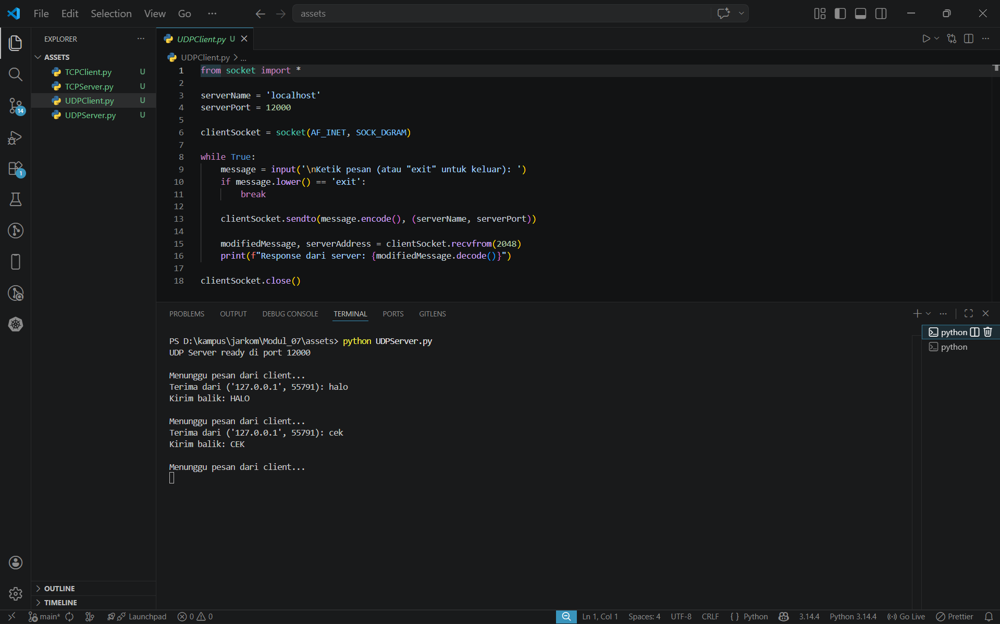
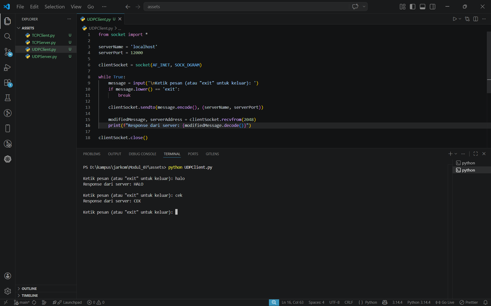
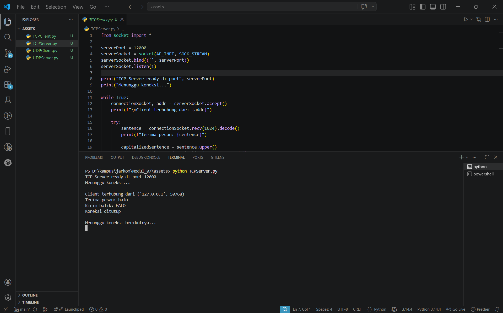
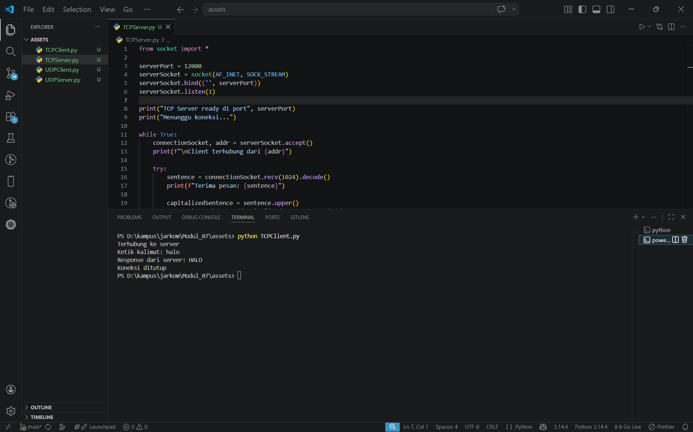

# Laporan Praktikum Jaringan Komputer - Modul 7
## Socket Programming: UDP dan TCP

> **Semester Genap 2025/2026 | Fakultas Informatika | Universitas Telkom**

---

### Identitas Praktikan

| Keterangan | Informasi |
|------------|-----------|
| **Nama Lengkap** | Ridho Bintang Adwitya |
| **NIM** | 103072400015 |
| **Kelas** | IF-04-01 |

---

## 1. Tujuan Praktikum

| No | Tujuan | Penjelasan |
|----|--------|-----------|
| 1 | Membuat aplikasi client-server UDP | Memahami implementasi socket UDP untuk komunikasi tanpa koneksi |
| 2 | Membuat aplikasi client-server TCP | Memahami implementasi socket TCP dengan mekanisme koneksi |
| 3 | Memahami perbedaan UDP dan TCP | Mengetahui karakteristik dan use case masing-masing protokol |
| 4 | Menganalisis pertukaran data | Mampu melacak alur komunikasi antara client dan server |

---

## 2. Dasar Teori

### 2.1 Konsep Socket Programming

| Istilah | Definisi |
|---------|----------|
| **Socket** | Endpoint untuk komunikasi jaringan antara dua program |
| **Client** | Aplikasi yang memulai permintaan/koneksi ke server |
| **Server** | Aplikasi yang menunggu dan melayani permintaan client |
| **Binding** | Proses mengaitkan socket dengan alamat IP dan port tertentu |
| **Listen** | Server dalam mode siap menerima koneksi masuk |
| **Accept** | Server menerima koneksi dari client dan membuat socket khusus |
| **Connect** | Client memulai proses koneksi ke server |

### 2.2 Perbandingan UDP dan TCP

| Karakteristik | UDP | TCP |
|--------------|-----|-----|
| **Jenis Protokol** | Connectionless | Connection-oriented |
| **Handshake** | Tidak ada | 3-way handshake (SYN, SYN-ACK, ACK) |
| **Keandalan** | Tidak dijamin | Dijamin (ACK, retransmission) |
| **Urutan Data** | Tidak dijamin | Dijamin berurutan |
| **Overhead Header** | 8 byte | 20+ byte |
| **Kecepatan** | Lebih cepat | Ada delay handshake |
| **Flow Control** | Tidak ada | Ada (windowing mechanism) |
| **Use Case** | DNS, streaming, gaming | Web, email, file transfer |

---

## 3. Praktikum UDP Socket

### 3.1 Kode Program UDP Server

**File:** `UDPServer.py`

```python
from socket import *

serverPort = 12000
serverSocket = socket(AF_INET, SOCK_DGRAM)
serverSocket.bind(('', serverPort))

print("The server is ready to receive")

while True:
    message, clientAddress = serverSocket.recvfrom(2048)
    modifiedMessage = message.decode().upper()
    serverSocket.sendto(modifiedMessage.encode(), clientAddress)
```

**Penjelasan:**
- Server membuat socket UDP dengan `SOCK_DGRAM`
- Bind ke port 12000
- Looping terus menerus untuk menerima pesan dari client
- Mengubah pesan menjadi uppercase dan mengirim balik

---

### 3.2 Kode Program UDP Client

**File:** `UDPClient.py`

```python
from socket import *

serverName = 'localhost'
serverPort = 12000

clientSocket = socket(AF_INET, SOCK_DGRAM)
message = input('Input lowercase sentence: ')
clientSocket.sendto(message.encode(), (serverName, serverPort))

modifiedMessage, serverAddress = clientSocket.recvfrom(2048)
print(modifiedMessage.decode())

clientSocket.close()
```

**Penjelasan:**
- Client membuat socket UDP (tidak perlu bind port)
- Langsung kirim pesan ke server dengan `sendto()`
- Terima response dengan `recvfrom()`
- Tidak perlu `connect()` karena UDP connectionless

---

### 3.3 Hasil Eksekusi UDP

**Langkah Testing:**
1. Buka terminal 1 → jalankan server
2. Buka terminal 2 → jalankan client
3. Input pesan dan lihat hasilnya

**Terminal 1 - UDP Server:**


Server berjalan dan menunggu pesan dari client.

**Terminal 2 - UDP Client:**


Client mengirim pesan dan menerima response dari server.

**Hasil:**
- Input: `halo`
- Output dari server: `HALO`
- Pesan berhasil dikonversi ke uppercase

---

## 4. Praktikum TCP Socket

### 4.1 Kode Program TCP Server

**File:** `TCPServer.py`

```python
from socket import *

serverPort = 12000
serverSocket = socket(AF_INET, SOCK_STREAM)
serverSocket.bind(('', serverPort))
serverSocket.listen(1)

print('The server is ready to receive')

while True:
    connectionSocket, addr = serverSocket.accept()
    sentence = connectionSocket.recv(1024).decode()
    capitalizedSentence = sentence.upper()
    connectionSocket.send(capitalizedSentence.encode())
    connectionSocket.close()
```

**Penjelasan:**
- Server membuat socket TCP dengan `SOCK_STREAM`
- `listen(1)` → siap menerima koneksi (max 1 antrian)
- `accept()` → terima koneksi dari client, buat `connectionSocket` baru
- Setelah selesai, `connectionSocket.close()` (serverSocket tetap terbuka)

---

### 7.3.2 Kode Program TCP Client

**File:** `TCPClient.py`

```python
from socket import *

serverName = 'localhost'
serverPort = 12000

clientSocket = socket(AF_INET, SOCK_STREAM)
clientSocket.connect((serverName, serverPort))

sentence = input('Input lowercase sentence: ')
clientSocket.send(sentence.encode())

modifiedSentence = clientSocket.recv(1024)
print('From Server:', modifiedSentence.decode())

clientSocket.close()
```

**Penjelasan:**
- Client membuat socket TCP
- `connect()` → inisiasi koneksi (3-way handshake)
- Kirim data dengan `send()` (tidak perlu alamat tujuan)
- Terima response dengan `recv()`

---

### 7.3.3 Hasil Eksekusi TCP

**Langkah Testing:**
1. Buka terminal 1 → jalankan TCP server
2. Buka terminal 2 → jalankan TCP client
3. Input kalimat dan lihat hasilnya

**Terminal 1 - TCP Server:**


Server siap menerima koneksi dan memproses pesan dari client.

**Terminal 2 - TCP Client:**


Client terhubung ke server, mengirim pesan, dan menerima response.

**Hasil:**
- Input: `halo`
- Output dari server: `HALO`
- Koneksi TCP established sebelum transfer data

---

## 7.4 Perbandingan UDP vs TCP (Hasil Praktikum)

### 7.4.1 Perbedaan Implementasi

| Aspek | UDP | TCP |
|-------|-----|-----|
| **Socket Type** | `SOCK_DGRAM` | `SOCK_STREAM` |
| **Koneksi** | Tidak perlu `connect()` | Perlu `connect()` |
| **Server Socket** | 1 socket untuk semua client | 2 socket (serverSocket + connectionSocket) |
| **Send/Receive** | `sendto()` / `recvfrom()` | `send()` / `recv()` |
| **Address** | Harus specify alamat | Otomatis (sudah ada koneksi) |

---

### 7.4.2 Perbedaan Hasil Eksekusi

| Karakteristik | UDP | TCP |
|--------------|-----|-----|
| **Kecepatan** | Lebih cepat (langsung kirim) | Ada delay handshake |
| **Server** | Handle multiple client simultan | Handle 1 client per waktu |
| **Client** | Bisa kirim berkali-kali | Kirim 1x, koneksi selesai |
| **Reliability** | Tidak ada jaminan | Data terjamin sampai |

---

## 7.5 Analisis Praktikum

### 7.5.1 UDP Socket

**Hasil Pengamatan:**
- Server bisa menerima pesan dari berbagai client
- Tidak ada proses koneksi yang terlihat
- Pesan langsung dikirim dan diterima
- Tidak ada konfirmasi delivery

**Keunggulan UDP:**
- Implementasi sederhana
- Tidak ada overhead koneksi
- Cocok untuk aplikasi real-time

**Keterbatasan:**
- Tidak ada jaminan pesan sampai
- Tidak ada urutan data
- Tidak ada retransmisi

---

### 7.5.2 TCP Socket

**Hasil Pengamatan:**
- Ada proses `connect()` sebelum kirim data
- Server membuat socket khusus untuk setiap client
- Data terjamin sampai dan berurutan
- Koneksi ditutup setelah selesai

**Keunggulan TCP:**
- Reliable delivery
- Data terurut
- Flow control & congestion control

**Keterbatasan:**
- Overhead lebih besar
- Ada delay handshake
- Lebih kompleks

---

## 7.6 Testing Tambahan

### 7.6.1 Multiple Clients (UDP)

**Test:** Jalankan beberapa client secara bersamaan

**Hasil:**
- UDP server bisa handle multiple clients
- Semua client menggunakan socket yang sama
- Pesan diproses satu per satu dalam loop

---

### 7.6.2 Multiple Clients (TCP)

**Test:** Coba connect beberapa client

**Hasil:**
- TCP server handle client secara sequential
- Client kedua harus tunggu client pertama selesai
- Setiap client dapat `connectionSocket` terpisah

**Catatan:** Untuk handle concurrent clients, perlu implementasi threading.

---

## 7.7 Kesimpulan

| Aspek | UDP Socket | TCP Socket |
|-------|------------|------------|
| **Implementasi** | Lebih sederhana | Lebih kompleks tapi reliable |
| **Koneksi** | Connectionless (tidak perlu handshake) | Connection-oriented (perlu 3-way handshake) |
| **Delivery** | Tidak ada jaminan delivery | Data terjamin sampai |
| **Urutan Data** | Tidak dijamin | Terjamin berurutan |
| **Prioritas** | Mengutamakan kecepatan | Mengutamakan keandalan |
| **Metode Kirim** | `sendto()` | `send()` |
| **Metode Terima** | `recvfrom()` | `recv()` |
| **Socket Server** | 1 socket untuk semua client | 2 socket (`serverSocket` + `connectionSocket`) |
| **Fungsi Wajib** | Tidak perlu `connect()`/`listen()`/`accept()` | Perlu `connect()`/`listen()`/`accept()` |
| **Use Case** | DNS, Streaming, VoIP, Gaming | Web, Email, File Transfer |
| **Nilai Utama** | **Socket programming memberikan kontrol penuh terhadap komunikasi jaringan di application layer** | **Socket programming memberikan kontrol penuh terhadap komunikasi jaringan di application layer** |

---