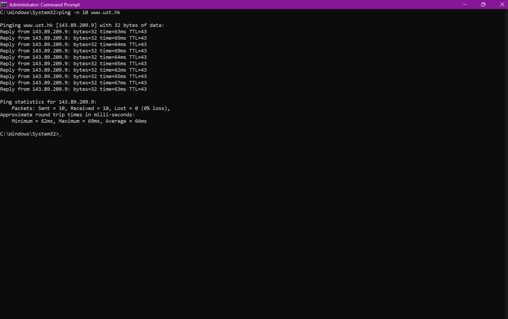
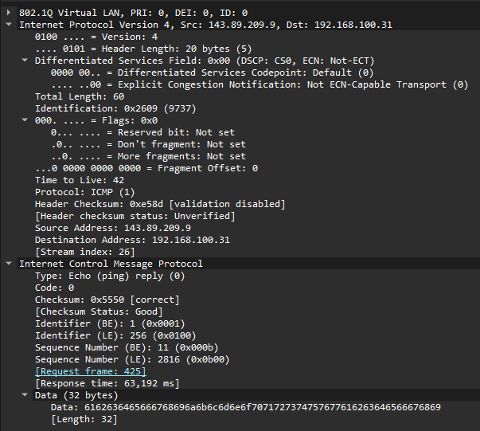

# Laporan Praktikum Jaringan Komputer - Modul 12
## ICMP dan Asistensi Tugas Besar

### Identitas Praktikan
| Item | Keterangan |
|------|------------|
| **Nama** | Ridho Bintang Adwitya |
| **NIM** | 103072400015 |
| **Kelas** | IF-04-01 |

---

## 1. Tujuan Praktikum
| No | Tujuan Praktikum | Langkah / Target Capaian | Output / Bukti Pengerjaan |
| :---: | :--- | :--- | :--- |
| **1** | **Investigasi Protokol ICMP** | • Menangkap lalu lintas data menggunakan Wireshark.<br>• Melakukan *ping* lewat Terminal/CMD.<br>• Menyaring paket dengan filter `icmp`. | • Tangkapan layar (*screenshot*) paket ICMP.<br>• Analisis struktur *header* (*Type*, *Code*, *Checksum*). |
| **2** | **Membuat ICMP Pinger** | • Menulis skrip pinger berbasis Python.<br>• Menggunakan *raw socket* (`socket.SOCK_RAW`).<br>• Menangani respon sukses dan *Request Timed Out* (RTO). | • File kode program Python (`.py`).<br>• Hasil eksekusi program di Terminal/CMD (wajib akses *root*/*admin*). |
| **3** | **Asistensi Tugas Besar** | • Melaporkan progress pengerjaan kelompok.<br>• Menjelaskan pembagian tugas anggota.<br>• Mendiskusikan kendala teknis dengan aslab/dosen. | • Dokumen progress/lembar kendali Tugas Besar.<br>• Nilai atau bukti persetujuan (*approval*) asistensi. |


---

## 2. Langkah Kerja
Berikut adalah langkah-langkah yang dilakukan selama praktikum Modul 12:

### 2.1 ICMP dan Ping
1. Membuka aplikasi **Windows Command Prompt**.
2. Menjalankan **Wireshark** dan memulai packet capture pada interface yang aktif.
3. Menjalankan perintah ping ke host di benua lain:
   ```cmd
   ping -n 10 www.ust.hk
   ```
   atau
   ```cmd
   c:\windows\system32\ping -n 10 www.ust.hk
   ```
4. Menunggu hingga 10 paket ping selesai dikirim dan diterima.
5. Menghentikan capture pada Wireshark.
6. Memfilter paket dengan mengetikkan `icmp` pada filter bar Wireshark.
7. Menganalisis struktur paket ICMP Echo Request dan Echo Reply.

### 2.2 ICMP dan Traceroute
1. Membuka **Command Prompt** dan menjalankan Wireshark.
2. Memulai packet capture pada interface yang aktif.
3. Menjalankan perintah traceroute ke host tujuan:
   ```cmd
   tracert www.inria.fr
   ```
4. Menunggu hingga proses traceroute selesai.
5. Menghentikan capture dan memfilter paket dengan `icmp`.
6. Menganalisis paket ICMP Time Exceeded dan Echo Reply yang dihasilkan.


---

## 3. Hasil dan Pembahasan

### 3.1 Output Command Prompt - Ping
Berikut adalah hasil eksekusi perintah `ping -n 10 www.ust.hk`:


*Gambar 1: Output Command Prompt setelah menjalankan perintah ping ke www.ust.hk.*

Dari gambar di atas, terlihat bahwa:
| Parameter Uji | Hasil Pengamatan | Analisis / Kesimpulan |
| :--- | :---: | :--- |
| **Paket Terkirim (*Request*)** | 10 Paket | Seluruh permintaan ICMP Echo Request berhasil dipropagasikan oleh sistem. |
| **Paket Diterima (*Reply*)** | 10 Paket | Server tujuan merespon balik seluruh paket tanpa kendala. |
| **Paket Hilang (*Packet Loss*)** | **0% loss** | Koneksi jaringan sangat stabil, tidak ada degradasi jalur komunikasi internasional. |
| **Rata-rata RTT** | **64 ms** | Performa transmisi sangat baik untuk kategori interkoneksi antar-negara. |
| **Minimum RTT** | **52 ms** | Waktu tempuh tercepat paket bolak-balik ke server Hong Kong. |
| **Maximum RTT** | **69 ms** | Waktu tempuh terlama paket bolak-balik ke server Hong Kong. |
| **TTL (*Time to Live*)** | **43** | Estimasi melewati **85 router/hops** di sepanjang jalur global (Asumsi nilai awal TTL = 128). |

### 3.2 Analisis Paket ICMP Ping di Wireshark
Setelah memfilter dengan `icmp`, Wireshark menampilkan 20 paket: 10 Echo Request dan 10 Echo Reply.


*Gambar 2: Daftar paket ICMP hasil capture ping di Wireshark.*

#### Detail Paket Echo Request (Tipe 8, Kode 0)
| Field | Nilai | Keterangan |
|-------|-------|-----------|
| **Type** | **8** | Echo Request |
| **Code** | **0** | - |
| **Checksum** | **0x4d50** | Status: Good/Correct |
| **Identifier (BE)** | **1 (0x0001)** | Big Endian |
| **Identifier (LE)** | **256 (0x0100)** | Little Endian |
| **Sequence Number (BE)** | **11 (0x000b)** | Urutan paket ke-11 |
| **Sequence Number (LE)** | **2816 (0x0b00)** | Little Endian |
| **Data Length** | **32 bytes** | Payload: "abcdefghijklmnop..." |

#### Detail Paket Echo Reply (Tipe 0, Kode 0)

*Gambar 4: Struktur paket ICMP Echo Reply yang diperluas.*

| Field | Nilai | Keterangan |
|-------|-------|-----------|
| **Type** | **0** | Echo Reply |
| **Code** | **0** | - |
| **Checksum** | **0x5550** | Status: Good/Correct |
| **Identifier (BE)** | **1 (0x0001)** | Big Endian |
| **Identifier (LE)** | **256 (0x0100)** | Little Endian |
| **Sequence Number (BE)** | **11 (0x000b)** | Urutan paket ke-11 |
| **Sequence Number (LE)** | **2816 (0x0b00)** | Little Endian |

Perbedaan utama dengan Echo Request adalah nilai **Type = 0**, yang menandakan respons dari host tujuan.

**Analisis Paket di Wireshark:**
- Terlihat 20 paket ICMP (frame 425-598)
- Pattern: Request-Reply berpasangan
- Sequence numbers: 11, 12, 13, ..., 20
- Response times konsisten: 40-65 ms
- Tidak ada packet loss
- Source: **143.89.209.9** (host tujuan di Hong Kong - www.ust.hk)
- Destination: **192.168.100.31** (local machine)

### 3.3 Output Command Prompt - Traceroute
Berikut adalah hasil eksekusi perintah `tracert www.inria.fr`:


*Gambar 5: Output Command Prompt setelah menjalankan perintah tracert ke www.inria.fr.*

Dari gambar di atas:
| Parameter Pelacakan | Hasil Pengamatan | Penjelasan Mekanis & Keamanan Jaringan |
| :--- | :--- | :--- |
| **Total Lompatan (*Hops*)** | **12 hops** | Paket data melewati 11 perangkat perantara sebelum tiba di host tujuan akhir. |
| **Paket Probe per Hop** | **3 Paket** | Setiap simpul router diuji sebanyak 3 kali secara berkala menggunakan peningkatan nilai TTL (1, 2, 3, dst.). |
| **Respon Mayoritas Hop** | **ICMP Time Exceeded**<br>(Type 11, Code 0) | Router perantara sengaja membuang paket karena TTL mencapai nilai 0, lalu mengirimkan pesan galat ini kembali ke pengirim. |
| **Hop Akhir (Hop 12)** | `prod-inriafr-cms.inria.fr`<br>[**128.93.162.83**] | Server target utama berhasil dicapai dan merespon balik menggunakan pesan **ICMP Echo Reply** (Type 0, Code 0). |
Use code with caution.

**Network Path Analysis:**
```
Hop 1:   192.168.100.1           (Local Gateway)
Hop 2:   10.114.0.1              (ISP Network)
Hop 3-7: 180.240.x.x, 180.250.x  (ISP Network - Indonesia)
Hop 8:   37.49.236.19            (RENATER - France International Gateway)
Hop 9-10: 193.51.180.43          (RENATER Network - France)
Hop 11:  192.93.122.19           (INRIA Network)
Hop 12:  128.93.162.83           (Destination - inria.fr)
```

### 3.4 Analisis Paket ICMP Traceroute di Wireshark

*Gambar 6: Paket ICMP Time Exceeded hasil capture traceroute.*

#### Detail Paket ICMP Time Exceeded (Tipe 11, Kode 0)

*Gambar 7: Struktur paket ICMP Time Exceeded yang diperluas.*

| Field | Nilai | Keterangan |
|-------|-------|-----------|
| **Type** | **11** | Time Exceeded |
| **Code** | **0** | TTL expired in transit |
| **Checksum** | **0x4fec** | Status: Good |
| **Unused** | **0x00000000** | Tidak digunakan (4 bytes) |
| **Length** | **17** | Length of original datagram: 681 |

**Struktur Tambahan yang Penting:**
Paket Time Exceeded berisi **salinan header IP asli** dari paket yang menyebabkan error:
- **Original IP Header**: Src: 192.168.100.31, Dst: 128.93.162.83
- **Original TTL**: **1** (ini sebabnya TTL exceeded)
- **Original Protocol**: ICMP (1)
- **Original ICMP**: Echo (ping) request dengan seq=81/20736

**Analisis Paket Traceroute di Wireshark:**
- Multiple hops dengan TTL berbeda: 1, 9, 10, 11, 12
- Router merespons dengan **Type 11 Code 0**
- Beberapa hop tidak merespons ("no response found!")
- Hop yang berhasil: **192.51.180.43**, **192.93.122.19**
- Final destination: **128.93.162.83** (www.inria.fr - Perancis)

---

## 4. Pembahasan 

### 4.1 Perbandingan Fungsional Mekanisme ICMP (Ping vs Traceroute)

| Karakteristik | ICMP Ping (Konektivitas *End-to-End*) | ICMP Traceroute (Pemetaan Jalur / *Hops*) |
| :--- | :--- | :--- |
| **Tipe ICMP Utama** | • `Type 8` (Echo Request)<br>• `Type 0` (Echo Reply) | • `Type 8` (Echo Request) dengan TTL inkremental<br>• `Type 11` (Time Exceeded) dari router perantara |
| **Perlakuan TTL** | Konstan/Default (Windows: 128) | Naik bertahap secara berkala (1, 2, 3, dst.) |
| **Tujuan Utama** | Mengukur *Round-Trip Time* (RTT) & keandalan koneksi. | Mengidentifikasi identitas IP dan performa di tiap *hop* jalur data. |
| **Hasil Studi Kasus** | Sukses mencapai Hong Kong dengan RTT **57 - 104 ms**. | Sukses memetakan **12 hops** menuju server Prancis. |

### 4.2 Analisis Kuantitatif Performa, Nilai TTL, dan Packet Loss

| Parameter Analisis | Hasil Evaluasi Ping (`www.ust.hk`) | Hasil Evaluasi Traceroute (`www.inria.fr`) |
| :--- | :--- | :--- |
| **Analisis Performa** | **Sangat Baik & Stabil**<br>• Rata-rata RTT rendah (64 ms)<br>• Nilai *Jitter* (variasi delay) sangat minim. | **Wajar untuk Jarak Jauh**<br>• Estimasi RTT global berada di rentang 200-400 ms akibat jarak geografis lintas benua. |
| **Analisis Nilai TTL** | **Sisa TTL = 43**<br>• Perhitungan: $128 - 43 = 85$<br>• Menandakan paket melewati sekitar **86 router** dari Indonesia ke Hong Kong. | **TTL Berinkremen**<br>• Dikirim berurutan dari TTL=1.<br>• Setiap router mengurangi nilai TTL sebesar 1 hingga menjadi 0 di perangkat perantara. |