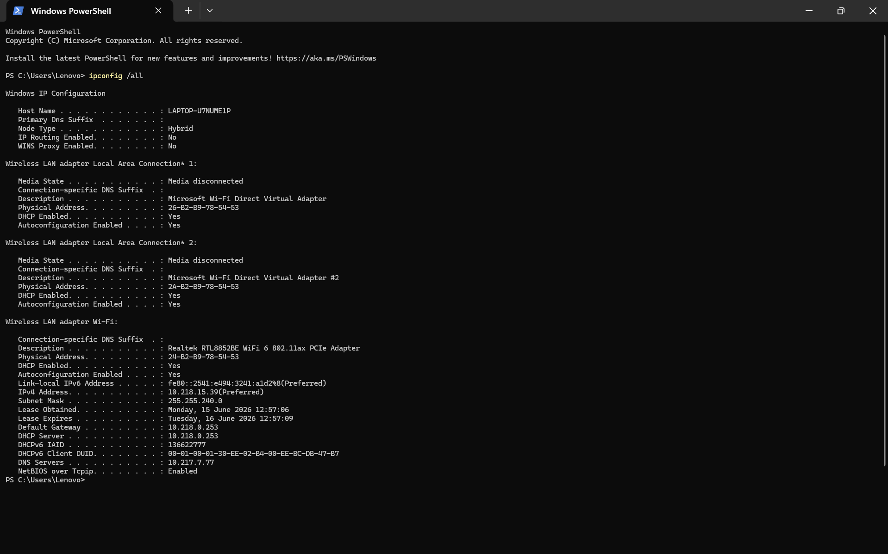
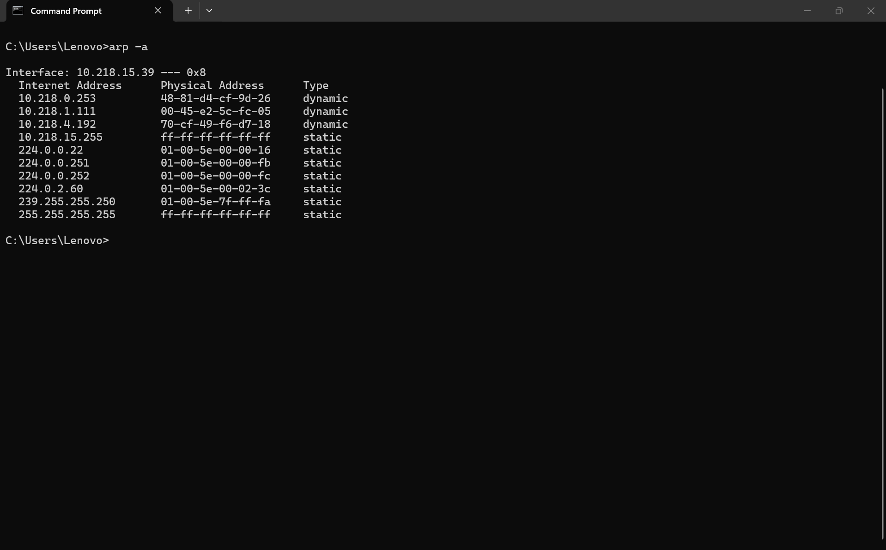
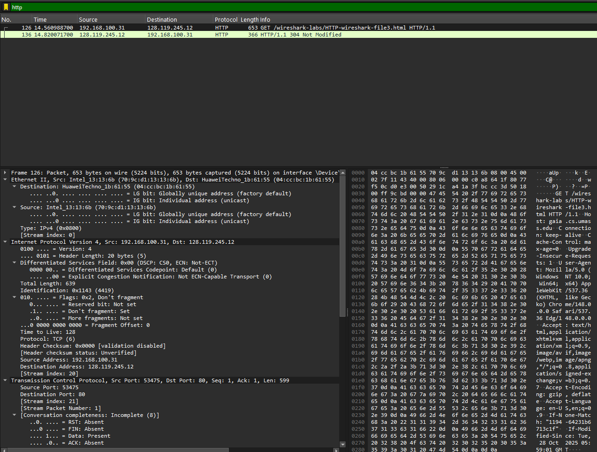
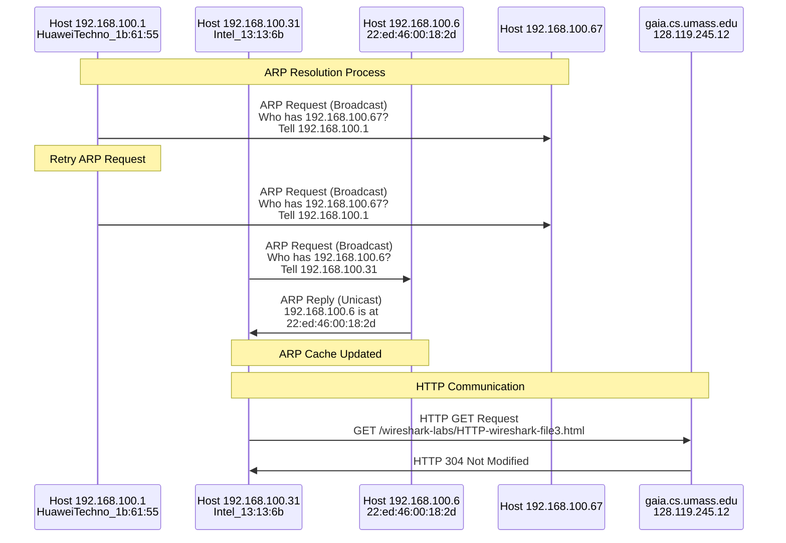

# Laporan Praktikum Jaringan Komputer - Modul 13

## Identitas Praktikan

| Item | Keterangan |
|------|------------|
| **Nama** | Ridho Bintang Adwitya |
| **NIM** | 103072400015 |
| **Kelas** | IF-04-01 |
| **Mata Kuliah** | Praktikum Jaringan Komputer |
| **Semester** | Genap 2025/2026 |

---

## 1. Tujuan Praktikum

Berdasarkan modul praktikum Jaringan Komputer Semester Genap 2025/2026, tujuan dari Modul 13 adalah:

| No | Tujuan Praktikum |
| :---: | :--- |
| **1** | Mahasiswa dapat menginvestigasi cara kerja Ethernet dan ARP menggunakan Wireshark |
| **2** | Mahasiswa mampu menganalisis struktur frame Ethernet |
| **3** | Mahasiswa memahami mekanisme Address Resolution Protocol (ARP) |
| **4** | Mahasiswa dapat menganalisis cache ARP dan proses resolusi alamat |

---

## 2. Langkah Kerja

Berikut adalah langkah-langkah yang dilakukan selama praktikum Modul 13:

### 2.1 Persiapan dan Capture Frame Ethernet

1. Membersihkan cache browser (Mozilla Firefox: Tools -> Clear Recent History -> Cache)
2. Membuka Wireshark dan memulai packet capture
3. Mengakses URL: `http://gaia.cs.umass.edu/wireshark-labs/HTTP-ethereal-lab-file3.html`
4. Browser menampilkan dokumen "Bill of Rights AS"
5. Menghentikan capture dan menganalisis frame Ethernet

### 2.2 Analisis ARP Cache

1. Melihat isi ARP cache menggunakan perintah:
   - **Windows**: `arp -a` di command prompt
2. Mengamati entry dynamic dan static dalam ARP cache
3. Mengidentifikasi interface network yang aktif

### 2.3 Mengamati Aksi ARP

1. Membersihkan cache ARP dan cache browser
2. Memulai Wireshark capture
3. Mengakses URL yang sama
4. Menganalisis paket ARP Request dan ARP Reply
5. Menggunakan filter `arp.opcode == 2` untuk melihat ARP Reply
6. Menggunakan filter `arp` untuk melihat semua traffic ARP

---

## 3. Hasil dan Pembahasan

### 3.1 Konfigurasi Network Interface



*Gambar 1: Output ipconfig /all menunjukkan konfigurasi network adapter*

#### Informasi Network Interface

| Parameter | Nilai |
|-----------|-------|
| **Host Name** | LAPTOP-U7NUME1P |
| **Adapter** | Realtek RTL8852BE WiFi 6 802.11ax PCIe Adapter |
| **Physical Address (MAC)** | 24-B2-B9-78-54-53 |
| **IPv4 Address** | 10.218.15.39 |
| **Subnet Mask** | 255.255.240.0 |
| **Default Gateway** | 10.218.0.253 |
| **DHCP Server** | 10.218.0.253 |
| **DNS Server** | 10.217.7.77 |
| **Lease Obtained** | Monday, 15 June 2026 12:57:06 |
| **Lease Expires** | Tuesday, 16 June 2026 12:57:09 |

### 3.2 ARP Cache Analysis



*Gambar 2: Output perintah arp -a menunjukkan ARP cache table*

#### ARP Cache Table

| Internet Address | Physical Address | Type |
|-----------------|------------------|------|
| 10.218.0.253 | 48-81-d4-cf-9d-26 | dynamic |
| 10.218.1.111 | 00-45-e2-5c-fc-05 | dynamic |
| 10.218.4.192 | 70-cf-49-f6-d7-18 | dynamic |
| 10.218.15.255 | ff-ff-ff-ff-ff-ff | static |
| 224.0.0.22 | 01-00-5e-00-00-16 | static |
| 224.0.0.251 | 01-00-5e-00-00-fb | static |
| 224.0.0.252 | 01-00-5e-00-00-fc | static |
| 224.0.2.60 | 01-00-5e-00-02-3c | static |
| 239.255.255.250 | 01-00-5e-7f-ff-fa | static |
| 255.255.255.255 | ff-ff-ff-ff-ff-ff | static |

**Penjelasan:**
- **Dynamic entries**: Entry yang dipelajari secara otomatis melalui ARP protocol (10.218.0.253, 10.218.1.111, 10.218.4.192)
- **Static entries**: Entry yang sudah ada secara permanen, biasanya untuk broadcast dan multicast addresses
- Interface yang aktif: 10.218.15.39 dengan identifier 0x8

### 3.3 Analisis ARP Reply


*Gambar 3: Detail ARP Reply packet (Frame 877)*

#### ARP Reply Structure (Frame 877)

| Field | Nilai | Keterangan |
|-------|-------|-----------|
| **Frame Number** | 877 |
| **Time** | 44.457816400 detik |
| **Source MAC** | 22:ed:46:00:18:2d | MAC address pengirim reply |
| **Destination MAC** | Intel_13:13:6b (70:9c:d1:13:13:6b) | MAC address tujuan |
| **Type** | 802.1Q Virtual LAN (0x8100) | VLAN tagging |
| **Protocol** | ARP (0x0806) |
| **Hardware Type** | Ethernet (1) |
| **Protocol Type** | IPv4 (0x0800) |
| **Opcode** | reply (2) | ARP Reply |
| **Sender MAC** | 22:ed:46:00:18:2d |
| **Sender IP** | 192.168.100.6 |
| **Target MAC** | 70:9c:d1:13:13:6b |
| **Target IP** | 192.168.100.31 |

#### Detail Ethernet Header

```
Ethernet II, Src: 22:ed:46:00:18:2d (22:ed:46:00:18:2d), Dst: Intel_13:13:6b (70:9c:d1:13:13:6b)
    Destination: Intel_13:13:6b (70:9c:d1:13:13:6b)
        .... ..0. .... .... .... .... = LG bit: Globally unique address (factory default)
        .... ...0 .... .... .... .... = IG bit: Individual address (unicast)
    Source: 22:ed:46:00:18:2d (22:ed:46:00:18:2d)
        .... ..0. .... .... .... .... = LG bit: Locally administered address (this is NOT the factory default)
        .... ...0 .... .... .... .... = IG bit: Individual address (unicast)
    Type: 802.1Q Virtual LAN (0x8100)
        [Stream index: 8]
    802.1Q Virtual LAN, PRI: 0, DEI: 0, ID: 0
        000. .... .... .... = Priority: Best Effort (default) (0)
        ...0 .... .... .... = DEI: Ineligible
        .... 0000 0000 0000 = ID: 0
    Type: ARP (0x0806)
```

**Penjelasan:**
- ARP Reply dikirim sebagai **unicast** ke requesting host
- Sender (192.168.100.6) memberikan MAC address-nya (22:ed:46:00:18:2d) kepada target (192.168.100.31)
- Menggunakan VLAN tagging (802.1Q)
- Source MAC menggunakan locally administered address

### 3.4 Analisis ARP Request


*Gambar 4: Multiple ARP Requests (Frame 11641)*

#### ARP Request Structure (Frame 11641)

| Field | Nilai | Keterangan |
|-------|-------|-----------|
| **Frame Number** | 11641 |
| **Source MAC** | HuaweiTechno_1b:61:55 (04:cc:bc:1b:61:55) |
| **Destination** | Broadcast (ff:ff:ff:ff:ff:ff) |
| **Type** | ARP (0x0806) |
| **Hardware Type** | Ethernet (1) |
| **Protocol Type** | IPv4 (0x0800) |
| **Opcode** | request (1) |
| **Sender MAC** | 04:cc:bc:1b:61:55 |
| **Sender IP** | 192.168.100.1 |
| **Target MAC** | 00:00:00:00:00:00 (kosong) |
| **Target IP** | 192.168.100.67 |

#### Detail Packet

```
Ethernet II, Src: HuaweiTechno_1b:61:55 (04:cc:bc:1b:61:55), Dst: Broadcast (ff:ff:ff:ff:ff:ff)
    Destination: Broadcast (ff:ff:ff:ff:ff:ff)
        .... ..1. .... .... .... .... = LG bit: Locally administered address (this is NOT the factory default)
        .... ..11 .... .... .... .... = IG bit: Group address (multicast/broadcast)
    Source: HuaweiTechno_1b:61:55 (04:cc:bc:1b:61:55)
        .... ..0. .... .... .... .... = LG bit: Globally unique address (factory default)
        .... ...0 .... .... .... .... = IG bit: Individual address (unicast)
    Type: ARP (0x0806)
    [Stream index: 1]

Address Resolution Protocol (request)
    Hardware type: Ethernet (1)
    Protocol type: IPv4 (0x0800)
    Hardware size: 6
    Protocol size: 4
    Opcode: request (1)
    Sender MAC address: HuaweiTechno_1b:61:55 (04:cc:bc:1b:61:55)
    Sender IP address: 192.168.100.1
    Target MAC address: 00:00:00:00:00:00 (00:00:00:00:00:00)
    Target IP address: 192.168.100.67
```

**Penjelasan:**
- ARP Request dikirim secara **broadcast** (ff:ff:ff:ff:ff:ff)
- Sender (192.168.100.1) menanyakan "Who has 192.168.100.67?"
- Target MAC diisi dengan 00:00:00:00:00:00 karena belum diketahui
- Device dengan IP 192.168.100.67 akan merespons dengan ARP Reply

#### Traffic Pattern ARP Requests

Dari packet list terlihat multiple ARP requests:

| Frame No. | Source | Destination | Info |
|-----------|--------|-------------|------|
| 11752 | HuaweiTechno_1b:61:55 | Broadcast | Who has 192.168.100.67? Tell 192.168.100.1 |
| 11753 | Intel_13:13:6b | Broadcast | Who has 192.168.100.99? Tell 192.168.100.31 |
| 11756 | HuaweiTechno_1b:61:55 | Broadcast | Who has 192.168.100.67? Tell 192.168.100.1 |
| 11757 | HuaweiTechno_1b:61:55 | Broadcast | Who has 192.168.100.67? Tell 192.168.100.1 |
| 11758 | Intel_13:13:6b | Broadcast | Who has 192.168.100.99? Tell 192.168.100.31 |

**Pattern Analysis:**
- ARP requests diulang berkali-kali (retransmission)
- Dua device aktif melakukan ARP: 192.168.100.1 dan 192.168.100.31
- Target yang dicari: 192.168.100.67 dan 192.168.100.99

### 3.5 Analisis HTTP over Ethernet



*Gambar 5: HTTP GET Request (Frame 126)*

#### Informasi Paket HTTP

| Field | Nilai |
|-------|-------|
| **Frame Number** | 126 |
| **Time** | 14.560988700 detik |
| **Source IP** | 192.168.100.31 |
| **Destination IP** | 128.119.245.12 (gaia.cs.umass.edu) |
| **Source MAC** | Intel_13:13:6b (70:9c:d1:13:13:6b) |
| **Destination MAC** | HuaweiTechno_1b:61:55 (04:cc:bc:1b:61:55) |
| **Protocol** | HTTP |
| **Request** | GET /wireshark-labs/HTTP-wireshark-file3.html HTTP/1.1 |
| **Response** | HTTP/1.1 304 Not Modified |

#### Stack Protokol

```
Frame 126: 653 bytes on wire (5224 bits), 653 bytes captured (5224 bits)
├─ Ethernet II (Layer 2)
│  ├─ Destination: HuaweiTechno_1b:61:55 (04:cc:bc:1b:61:55)
│  ├─ Source: Intel_13:13:6b (70:9c:d1:13:13:6b)
│  └─ Type: IPv4 (0x0800)
├─ Internet Protocol Version 4 (Layer 3)
│  ├─ Version: 4
│  ├─ Header Length: 20 bytes (5)
│  ├─ Differentiated Services Field: 0x00 (DSCP: CS0, ECN: Not-ECT)
│  ├─ Total Length: 639
│  ├─ Identification: 0x1143 (4419)
│  ├─ Flags: 0x2, Don't fragment
│  ├─ Time to Live: 128
│  ├─ Protocol: TCP (6)
│  ├─ Source Address: 192.168.100.31
│  └─ Destination Address: 128.119.245.12
├─ Transmission Control Protocol (Layer 4)
│  ├─ Source Port: 53475
│  ├─ Destination Port: 80 (HTTP)
│  ├─ Seq: 1, Ack: 1, Len: 599
│  └─ [Stream index: 21]
└─ Hypertext Transfer Protocol (Layer 7)
   ├─ GET /wireshark-labs/HTTP-wireshark-file3.html HTTP/1.1
   ├─ Host: gaia.cs.umass.edu
   └─ [Response: HTTP/1.1 304 Not Modified]
```

#### Detail IP Header

```
Internet Protocol Version 4, Src: 192.168.100.31, Dst: 128.119.245.12
    0100 .... = Version: 4
    .... 0101 = Header Length: 20 bytes (5)
    Differentiated Services Field: 0x00 (DSCP: CS0, ECN: Not-ECT)
        0000 00.. = Differentiated Services Codepoint: Default (0)
        .... ..00 = Explicit Congestion Notification: Not ECN-Capable Transport (0)
    Total Length: 639
    Identification: 0x1143 (4419)
    Flags: 0x2, Don't fragment
        0... .... = Reserved bit: Not set
        .1.. .... = Don't fragment: Set
        ..0. .... = More fragments: Not set
    ...0 0000 0000 0000 = Fragment Offset: 0
    Time to Live: 128
    Protocol: TCP (6)
    Header Checksum: 0x0000 [validation disabled]
    Source Address: 192.168.100.31
    Destination Address: 128.119.245.12
```

**Penjelasan:**
- HTTP GET request dikirim dari client (192.168.100.31) ke server gaia.cs.umass.edu (128.119.245.12)
- Server merespons dengan **HTTP 304 Not Modified** (file belum berubah sejak terakhir diakses)
- TTL (Time to Live): 128 hops
- TCP segment dengan source port 53475 ke destination port 80 (HTTP)
- Payload size: 599 bytes

### 3.6 Perbandingan ARP Request dan ARP Reply

| Aspek | ARP Request | ARP Reply |
|-------|-------------|-----------|
| **Opcode** | 1 (request) | 2 (reply) |
| **Destination MAC** | Broadcast (ff:ff:ff:ff:ff:ff) | Unicast (specific MAC) |
| **Target MAC** | 00:00:00:00:00:00 (kosong) | Diisi dengan MAC address |
| **Direction** | Satu ke banyak (broadcast) | Point-to-point (unicast) |
| **Purpose** | Mencari owner IP address | Memberikan informasi MAC address |

### 3.7 Analisis Traffic Pattern



### 3.8 Struktur Frame Ethernet

#### Ethernet Frame dengan VLAN Tagging (802.1Q)

```
+------------------+------------------+------------------+
| Dest MAC         | Source MAC       | Type             |
| (6 bytes)        | (6 bytes)        | 0x8100 (802.1Q)  |
+------------------+------------------+------------------+
| 802.1Q Tag (4 bytes)                                   |
| PRI: 0, DEI: 0, VLAN ID: 0                             |
+------------------+------------------+------------------+
| EtherType: 0x0806 (ARP) / 0x0800 (IP)                  |
+------------------+------------------+------------------+
| Payload (46-1500 bytes)                                |
+------------------+------------------+------------------+
| Frame Check Sequence (FCS)                             |
| (4 bytes)                                              |
+------------------+------------------+------------------+
```

### 3.9 Kesimpulan Praktikum

Berdasarkan praktikum yang telah dilakukan, dapat disimpulkan:

1. **Konfigurasi Network Interface**
   - Host menggunakan WiFi adapter (Realtek RTL8852BE WiFi 6)
   - MAC Address: 24-B2-B9-78-54-53
   - IPv4 Address: 10.218.15.39 dengan subnet 255.255.240.0
   - Gateway dan DHCP Server: 10.218.0.253

2. **ARP Cache Management**
   - ARP cache berisi entry dynamic (dipelajari otomatis) dan static (permanen)
   - Entry dynamic untuk host yang pernah berkomunikasi
   - Entry static untuk broadcast dan multicast addresses

3. **ARP Request dan Reply**
   - ARP Request dikirim secara broadcast ke semua host di jaringan lokal
   - ARP Reply dikirim secara unicast ke requesting host
   - Target MAC dalam request diisi 00:00:00:00:00:00
   - ARP menggunakan opcode: 1 (request) dan 2 (reply)

4. **VLAN Tagging (802.1Q)**
   - Beberapa frame menggunakan VLAN tagging
   - Tag berisi Priority (PRI), Drop Eligible Indicator (DEI), dan VLAN ID
   - Menambah 4 bytes pada Ethernet header

5. **HTTP over TCP/IP over Ethernet**
   - HTTP request dibungkus dalam TCP segment (port 80)
   - TCP segment dibungkus dalam IP packet
   - IP packet dibungkus dalam Ethernet frame
   - Server merespons dengan HTTP 304 Not Modified untuk cache validation

6. **MAC Address Types**
   - Globally unique address (factory default): IG bit = 0
   - Locally administered address: LG bit = 1
   - Individual address (unicast): IG bit = 0
   - Group address (multicast/broadcast): IG bit = 1

---

### 4.2 Network Information

**Interface yang Aktif:**
- Interface: 10.218.15.39 (Index: 0x8)
- Wireless LAN adapter Wi-Fi

**ARP Cache Entries:**
- Dynamic: 3 entries (10.218.0.253, 10.218.1.111, 10.218.4.192)
- Static: 7 entries (broadcast dan multicast addresses)

**Traffic yang Dianalisis:**
- ARP Requests: Multiple requests untuk 192.168.100.67 dan 192.168.100.99
- ARP Reply: 192.168.100.6 is at 22:ed:46:00:18:2d
- HTTP: GET request ke /wireshark-labs/HTTP-wireshark-file3.html

---